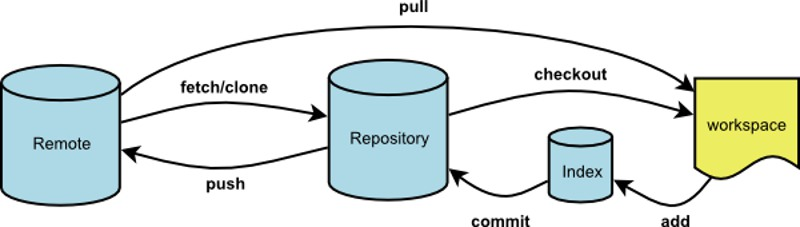

# Git

##  查看本地、切换分支、缓存、更新 、合并

```
git branch  //查看本地所有分支
git branch -a //查看本地和远程所有分支
git status    //查看上次提交之后是否有对文件进行再次修改
git log       //查看历史提交记录
git stash     //
git checkout xxx -b xx   //创建新分支xx与远程分支xxx链接并切换到该分支下
git pull --rebase   //
git stash pop  //
git checkout .  //用暂存区全部的文件替换工作区的文件
```

### git pull, git pull --rebase, git fetch, git merge

分支的概念： 
分支是用来标记特定代码的提交，每一个分支通过SHA1sum值来标识，所以对分支的操作是轻量级的，你改变的仅仅是SHA1sum值。



- `git fetch`是将远程主机的最新内容拉到本地，用户在检查了以后决定是否合并到工作本机分支中
- `git pull` 则是将远程主机的最新内容拉下来后直接合并，即：`git pull = git fetch + git merge`，这样可能会产生冲突，需要手动解决。

```
git pull = git fetch + git merge FETCH_HEAD 
git pull --rebase =  git fetch + git rebase FETCH_HEAD
```

