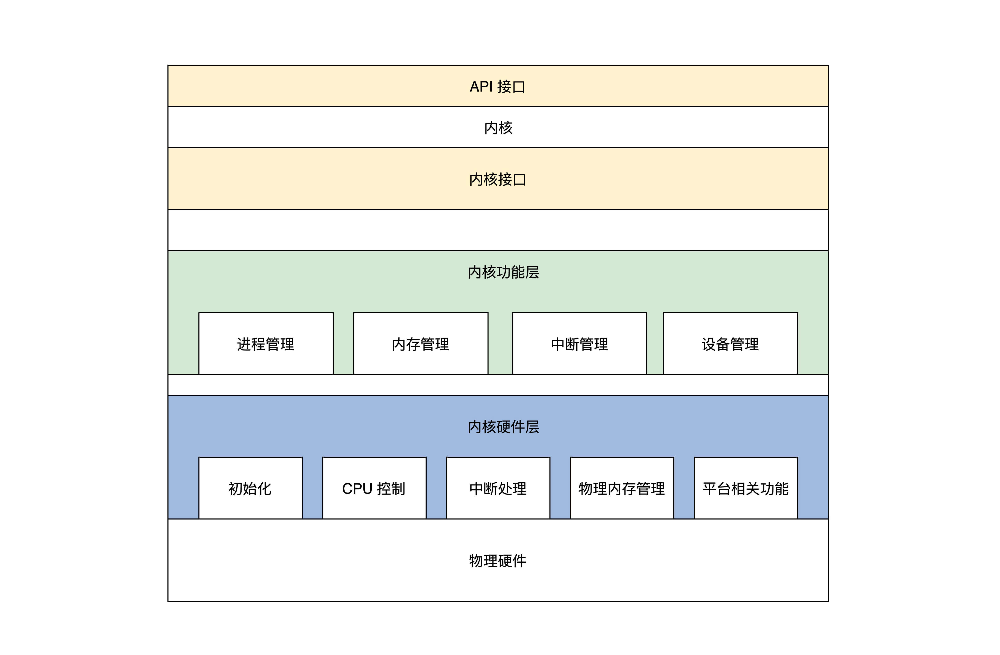

# 01 程序的运行过程：从代码到机器运行

## 程序编译过程


- 预处理：gcc HelloWorld.c -E -o HelloWorld.i， 加入头文件，替换宏
- 编译：gcc HelloWorld.i -S -c HelloWorld.o，转换成汇编程序
- 汇编：gcc HelloWorld.s -c HelloWorld.o，将汇编程序转换成可链接的二进制程序
- 链接：gcc HelloWorld.o - o，生成可执行文件

## 程序装载执行

- 图灵机
- 冯诺依曼体系结构：输入输出设备、存储器、运算器、控制器、总线

# 02 实现一个最简单的内核

写一个最小的操作系统Hello OS

## PC机的引导流程

### Hello OS的引导流程


PC机上电->PC机BIOS固件->加载可引导设备中的GRUB->GRUB引导->加载硬盘分区中的Hello OS文件->Hello OS

- PC机BIOS固件是固化在PC机主板上的ROM芯片中的，掉电也能保存，PC机上电后第一条指令就是BIOS固件中的
- 它负责检测和初始化CPU、内存及主板平台，然后加载引导设备（大概率是硬盘）中的第一个扇区数据，到0x7c00地址开始的内存空间，再接着跳转到0x7c00处执行指令，在本例中就是GRUB引导程序

### 拓展：UEFI BIOS

https://uefi.org/

## Hello OS引导汇编代码

- 为什么不能直接用C：C作为通用的高级语言，不能直接操作特定的硬件，而且C语言的函数调用、函数传参都需要用栈。栈由CPU特定的栈寄存器指向，所以要先用汇编代码处理好C语言的工作环境。

## Hello OS的主函数

main.c

main.c和entry.asm分别用GCC和nasm编译成可链接模块，由LD链接器链接在一起，形成可执行的程序文件

## 控制计算机屏幕

实现printf函数

- 计算机屏幕显示往往为显卡的输出，显卡分为集显（集成在主板的显卡），核显（做在CPU芯片内的显卡），独显（独立存在通过PCIE接口连接的显卡），性能依次上升，价格同样
- 独显往往有自己的RAM、多达几百个运算核心的处理器，不仅仅可以显示图像，而且可以执行大规模并行计算，如“挖矿”
- PC上无论何种显卡，都支持VESA标准，该标准下有两种工作模式：字符模式和图形模式。显卡为了兼容这种标准，提供VGABIOS的固件程序

### 字符工作模式

把屏幕分成24行，每行80个字符，把这（24*80）个位置映射到以0xb8000地址开始的内存中，每两个字节对应一个字符，其中一个字节是字符的ASCII码，另一个字节为字符的颜色值。


## 编译和安装Hello OS

### make工具

- make是一个工具程序，读取一个叫“makefile”的文件，文件中写好了构建软件的规则，它能够根据这些规则自动化构建软件。
- makefile文件规则：首先有一个或多个构建目标称为“target”；目标后面紧跟着用于构建该目标所需要的文件，目标下面是构建该目标所需要的命令及参数。同时，它也检查文件的依赖关系。
- 第一次构建目标后，下次执行make时，它会根据该目标所依赖的文件是否更新决定是否编译该目标，若所依赖的文件没有更新且该目标又存在，那么它便不会构建该目标。

例子：

```makefile
CC = gcc  #定义一个宏CC 等于gcc
CFLAGS = -c  #定义一个宏 CFLAGS 等于-c
OBJS_FILE = file.o file1.o file2.o file3.o file4.o  
.PHONY : all everything  #定义两个伪目标 all、everything
all : everything
everything :$(OBJS_FILE) #伪目标everything依赖于OBJS_FILE
%.o : %.c
	$(CC) $(CFLAGS) -o $@ $<
```

规则：

- “=”或“:=”，定义宏
- .PHONY，定义伪目标，不代表一个真正的文件名，在执行make时可以指定这个目标来执行其所在规则定义的命令。但是伪目标可以依赖于另一个伪目标或文件
- %，通配符

### 编译

编译过程：最终得到Hello OS.bin文件


### 安装Hello OS

- 要让GRUB能够找到Hello OS.bin文件，才能在计算机启动时加载它，这个过程称为安装。
- GRUB在启动时会加载一个grub.cfg的文本文件，其中一部分内容就是启动项。
- GRUB首先会显示启动项到屏幕，然后让我们选择启动项，最后GRUB根据启动项对应的信息，加载OS文件到内存

## 问题

- makefile
- 通过grub查找/boot所在的分区
- 未解决：选择HelloOS报错：'Secure Boot forbids loading module from (hd2,gpt1)/boot/grub/x86_64-efi/multiboot2.mod. you need to load the kernel first'

# 03 内核结构与设计

## 内核内部组成逻辑

内核可以看作是计算机资源的管理者

### 计算机资源

硬件资源：

- 总线
- CPU，中央处理器，负责执行程序和处理数据运算
- 内存，负责存储运行时的代码和数据
- 硬盘，负责长久存储用户文件数据
- 网卡，负责计算机与其他设备之间的通信
- 显卡
- I/O设备


软件资源：文件、软件程序等

### 内核组成逻辑

1. 管理CPU，CPU执行程序，内核把运行时的程序抽象成进程，又称为进程管理
2. 管理内存，分配、释放内存
3. 管理硬盘，银盘主要存放用户数据，内核将用户数据抽象成文件，形成文件系统
4. 管理显卡，图形系统
5. 管理网卡，网络协议栈，又称网络组件
6. 管理I/O设备，I/O管理器
7. 安全组件

**硬件驱动**

## 经典内核结构

### 宏内核结构

把上述功能模块的代码经过编译，最后链接在一起，形成一个大的可执行程序，向用户应用软件提供一些接口（API），而达成许会在处理器的特权模式下运行，通常称为宏内核模式。


宏内核结构缺点：没有模块化，各个模块高度耦合，没有拓展性和可移植性。开发一个新的功能就要重新编译、链接、安装内核。

优点：性能好，各个组件可以相互调用，性能极高

### 微内核结构

提倡内核功能尽可能少：仅有进程调度、处理中断、内存空间映射、进程间通信等，把实际的进程管理、文件管理、设备管理、内存管理等服务功能，作成一个个服务进程。和用户进程一样。

微内核定义了一种良好的进程间通信的机制——消息。


微内核优点：系统结构清晰利于协作开发；有良好的移植性；有良好的伸缩性、扩展性，因为那些系统功能只是一个进程，可以随时减少或增加

代表：MACH、MINIX、L4

缺点：性能差

## 分离硬件的相关性

系统内核分层，把操作硬件和处理硬件功能差异的代码抽离出来，形成一个独立的软件抽象层，对外提供相应的接口，方便上层开发

- 好处：屏蔽底层细节，，使上层开发更简单。
- 基本方法：增加一个抽象层

## 设计一个操作系统内核（混合内核）

### 混合内核

KML：https://www.cnblogs.com/call-me-dasheng/p/14343705.html

内核模块，也称为可加载内核模块(LKM)，对于保持内核在不消耗所有可用内存的情况下与所有硬件一起工作是必不可少的。

模块通常向基本内核添加设备、文件系统和系统调用等功能。lkm的文件扩展名是.ko，通常存储在/lib/modules目录中。由于模块的特性，可以通过在启动时使menuconfig命令将模块设置为load或not load，或者通过编辑/boot/config文件，或者使用modprobe命令动态地加载和卸载模块，轻松定制内核。

Ubuntu中的内核文件存储在/boot文件夹中，称为vmlinux -version。

### 分层

- 内核接口层：定义一系列接口
  - 定义一套UNIX接口的子集
  - 检查其参数是否合法，参数有问题则返回相关的错误，调用下层完成功能的核心代码
- 内核功能层：完成各种实际功能
  - 进程管理：实现进程的创建、销毁和调度
  - 内存管理：页面内存池和任意大小的内存池
  - 中断管理：把中断回调函数安插到相关的数据结构中，一旦发生相关的中断就会调用该函数
  - 设备管理：用一系列的数据结构表示驱动程序模块、驱动程序本身、驱动程序创建的设备，最后组织在一起，实现创建、销毁、访问设备的代码，代码最终会调用设备驱动程序，从而操作设备
- 内核硬件层：主要包括一个硬件平台相关的代码
  - 初始化：初始化代码是内核被加载到内存中最先需要运行的代码，例如初始化少量设备、CPU、内存、中断的控制、内核用于管理的数据结构等
  - CPU控制：提供CPU模式设定、开关中断、读写CPU特定寄存器等功能的代码
  - 中断处理：保存中断时机器的上下文，调用中断回调函数，操作中断控制器等
  - 物理内存管理：提供分配、释放大块内存，内存空间映射，操作MMU、Cache等
  - 其他硬件平台相关的特殊功能




# 04 业界成熟的内核架构

## Linux内核

- 全称GNU/Linux，是一套免费使用和自由传播的操作系统，支持类UNIX、POSIX标准接口，也支持多用户、多进程、多线程，可以在多CPU的机器上运行。
- Liunx系统性能稳定且开源
- 所见皆文件


**五大重要组件**


- Linux模块之间的通信主要是函数调用，而且函数间的调用没有一定的层次关系，也没有左右边界的限定，函数的调用路径是纵横交错的
- 只要有一个函数出了问题，就会波及到全部组件，导致整个系统崩溃
- 模块之间没有隔离，安全隐患也是巨大的
- 优点是性能极高

## 对比Windows和macOS

### Darwin-XNU内核

Darwin使用了一种微内核（Mach）和相应的固件来支持不同的处理器平台，并提供操作系统原始的基础服务，上层的功能性系统服务和工具则是整合了BSD系统所提供的。

Darwin架构：两个内核层——Mach层和BSD层


Mach内核是卡耐基梅梅隆大学开发的经典微内核，意在提供最基本的操作系统服务，从而达到高性能、安全、可扩展的目的，而BSD则是伯克利大学开发的类UNIX操作系统，提供一整套操作系统服务。因为性能和兼容，保留Mach，加入了BSD


### Windows NT内核


**高内聚、低耦合**


## 总结

- Linux性能良好，结构异常复杂，不利于问题的排查和功能的扩展，宏内核
- Darwin-XNU（多核）和Windows（混合内核）结构良好，层面分明，利于功能扩展，不容易产生问题且性能稳定
- 宏内核相当于所有的功能都耦合在一起，放在内核内；微内核是把大多数功能解耦出来，放在用户态，使用IPC在用户态调用服务进程。混合结构其实与微内核相似，只不过解耦出来的这些功能依然放在内核里；内核模块是可以动态加载和卸载的。

# 05 CPU工作模式：执行程序的三种模式

按照CPU功能升级迭代的顺序，工作模式有**实模式、保护模式、长模式**

## 实模式（实地址模式）

- 运行真实的指令，对指令的动作不做区分，直接执行指令的真实功能
- 发往内存的地址是真实的，对任何地址不加限制的发往内存

### 实模式寄存器

CPU是根据指令完成相应的功能，指令的操作数，可以是寄存器、内存地址、常数，通常情况下是寄存器

x86 CPU在实模式下的寄存器，16位


### 实模式下访问内存

数据和指令都是存放在内存中的。取指令、访问内存数据都要访问内存

内存地址计算（分段内存管理模型）：段寄存器左移4位，加上一个通用寄存器中的值或常数形成地址，代码段由CS和IP确定的，栈段由SS和SP段确定的


```assembly
data SEGMENT ;定义一个数据段存放Hello World！
	hello DB 'Hello World!$'   ;要以$结束
data ENDS
code SEGMENT ;定义一个代码段存放程序指令
	ASSUME CS:CODE,DS:DATA ;DS指向数据段，CS指向代码段
start:
	MOV AX,data  ;将data段首地址赋值给AX
	MOV DS,AX    ;将AX赋值给DS，使DS指向data段
	LEA DX,hello ;使DX指向hello首地址
	MOV AH,09h   ;给AH设置参数09H，AH是AX高8位，AL是AX低8位
	INT 21h      ;执行DOS中断输出DS指向的DX指向的字符串hello
	MOV AX,4C00h ;给AH设置参数4C00h
	INT 21h      ;调用4C00h号功能，结束程序
code ENDS
ENDS start
```

### 实模式中断

- 先保存CS和IP寄存器，然后装载新的CS和IP寄存器

中断如何产生：

- 硬件中断：中断控制器给CPU发送了一个电子信号，CPU对这个信号做出应答
- 软件中断：CPU执行INT指令，指令后面会跟随一个常数，即软件中断号

中断向量表：表的地址和长度由CPU的特定寄存器IDTR指向，实模式下，表中的一个条目由代码段地址和段内偏移组成。

CPU获得中断号以后，根据IDTR寄存器中的信息，计算出中断向量中的条目，进而装载CS（装入代码段基地址）、IP（装入代码段内偏移）寄存器，最终响应中断。


## 保护模式

随着软件规模不断增加，需要更高的计算量、更大的内存容量。首先要解决的问题就是**寻址问题**。因为16位的寄存器最多只能表示 2^16 个地址，所以CPU的寄存器和运算单元都要扩展成32位的。


基于上述原因，CPU实现了保护模式。

### 保护模式寄存器

相对于实模式，保护模式增加了一些控制寄存器和段寄存器，扩展通用寄存器的位宽，所有的通用寄存器都是32位的，还可以单独使用低16位，低16位又可以拆分成两个8位寄存器。


### 保护模式特权级

区分指令和资源使用等级，4级，R0～R3，R0可以执行所有指令，R1、R2、R3等级依次递减，高特权级可以访问低特权级的资源，内存访问则是靠段描述符和特权级相互配合去实现的。

### 保护模式段描述符

目前为止，内存还是分段模型，要对内存进行保护，就可以转换成对段的保护。

由于CPU的扩展导致了32位的段基地址和段内偏移，还有一些其他信息，所以16位的段寄存器肯定放不下，需要把描述一个段的信息封装成特定格式的**段描述符**，放在**内存**中。

一个段描述符有64位8字节数据，包含段基地址、段长度、段权限、段类型（系统段、代码段、数据段）、是否可读写、可执行等，如下图。


多个段描述符在内存中形成全局段描述符表（如下图），该表的基地址和长度由CPU和GDTR寄存器指示。段寄存器不再存放段基地址，而是具体段描述符的索引，访问一个内存地址时，段寄存器中的索引首先会结合GDTR寄存器找到内存中的段描述符，再根据其中的段信息判断能不能访问成功。


### 保护模式段选择子

CS、DS、ES、SS、FS、GS这些段寄存器中存放的不止是内存段的描述符索引，还有影子寄存器、段描述符索引、描述符表索引、权限级别，称为保护模式段选择子


### 保护模式平坦模型


```assembly
GDT_START:
knull_dsc: dq 0
;第一个段描述符CPU硬件规定必须为0
kcode_dsc: dq 0x00cf9e000000ffff
;段基地址=0，段长度=0xfffff
;G=1,D/B=1,L=0,AVL=0 
;P=1,DPL=0,S=1
;T=1,C=1,R=1,A=0
kdata_dsc: dq 0x00cf92000000ffff
;段基地址=0，段长度=0xfffff
;G=1,D/B=1,L=0,AVL=0 
;P=1,DPL=0,S=1
;T=0,C=0,R=1,A=0
GDT_END:

GDT_PTR:
GDTLEN  dw GDT_END-GDT_START-1
GDTBASE  dd GDT_START
```

### 保护模式中断

- 实模式下CPU不需要做权限检查，所以可以直接通过中断向量表中的值装载CS:IP寄存器；

- 而保护模式下的中断要权限检查，还有特权级切换，所以就需要扩展中断向量表的信息，即每个中断向量表用一个中断门描述符来表示，也可简称为中断门，如下图

  

- 同样的，保护模式要实现中断，也必须在内存中有一个中断向量表，同样是由IDTR寄存器指向，如下图

  

- 产生中断后，CPU首先会检查中断号是否大于**最后一个中断门描述符**，x86 CPU最大支持256个中断源（即中断号：0～255），然后检查描述符类型（是否中断门或陷阱门）、是否为系统描述符，是否存在于内存中

- 接着检查中断门描述符中的段选择子指向的段描述符

- 最后做权限检查，如果CPL小于等于中断门的DPL并且CPL大于等于中断门中的段选择子，就指向段描述符的DPL

- 进一步的，CPL等于中断门中的段选择子指向段描述符的DPL，则为同级权限，不进行栈切换，否则进行栈切换。如果进行栈切换，还需要从TSS中加载具体权限的SS、ESP，还要对SS中段选择子指向的段描述符进行检查

- 完成上述检查后，CPU才会加载中断门描述符中目标代码段选择子到CS寄存器中，把目标代码段偏移加载到EIP寄存器中

## 实模式切换到保护模式


## 长模式

相对于保护模式，增加了一些通用寄存器，并扩展通用寄存器的位宽


