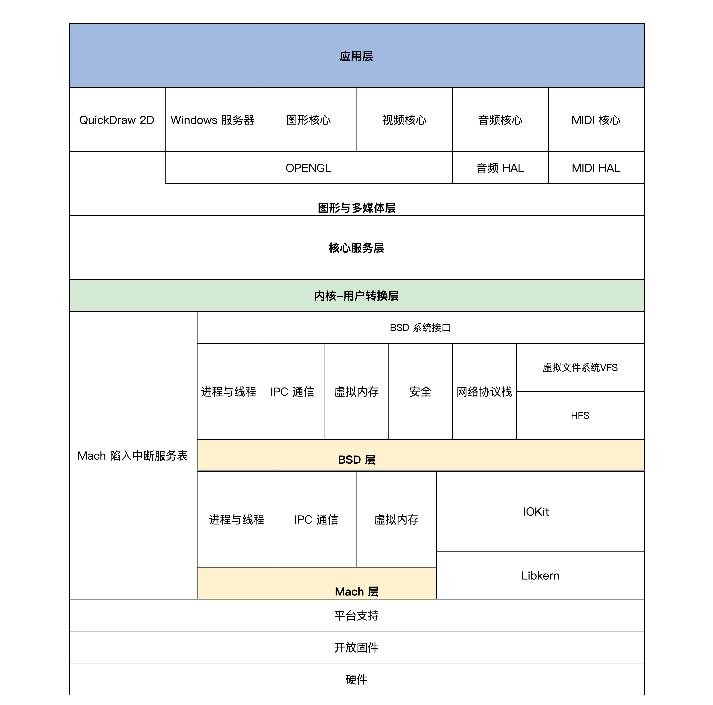
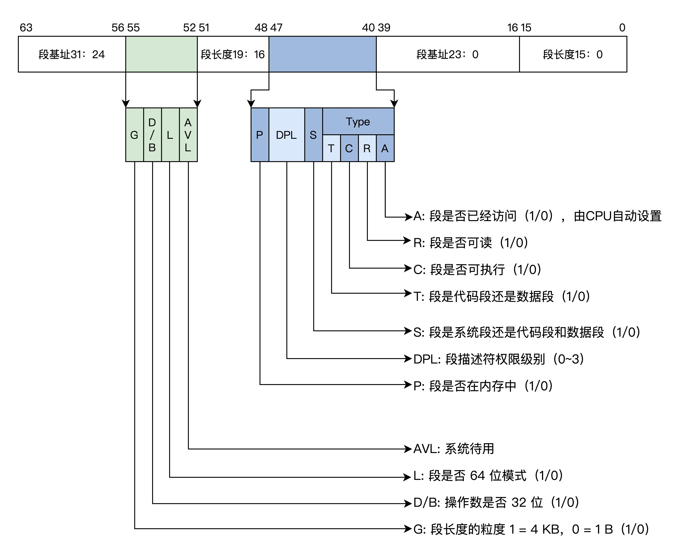

# 01 程序的运行过程：从代码到机器运行

## 程序编译过程


- 预处理：gcc HelloWorld.c -E -o HelloWorld.i， 加入头文件，替换宏
- 编译：gcc HelloWorld.i -S -c HelloWorld.o，转换成汇编程序
- 汇编：gcc HelloWorld.s -c HelloWorld.o，将汇编程序转换成可链接的二进制程序
- 链接：gcc HelloWorld.o - o，生成可执行文件

## 程序装载执行

- 图灵机
- 冯诺依曼体系结构：输入输出设备、存储器、运算器、控制器、总线

# 02 实现一个最简单的内核

写一个最小的操作系统Hello OS

## PC机的引导流程

### Hello OS的引导流程


PC机上电->PC机BIOS固件->加载可引导设备中的GRUB->GRUB引导->加载硬盘分区中的Hello OS文件->Hello OS

- PC机BIOS固件是固化在PC机主板上的ROM芯片中的，掉电也能保存，PC机上电后第一条指令就是BIOS固件中的
- 它负责检测和初始化CPU、内存及主板平台，然后加载引导设备（大概率是硬盘）中的第一个扇区数据，到0x7c00地址开始的内存空间，再接着跳转到0x7c00处执行指令，在本例中就是GRUB引导程序

### 拓展：UEFI BIOS

https://uefi.org/

## Hello OS引导汇编代码

- 为什么不能直接用C：C作为通用的高级语言，不能直接操作特定的硬件，而且C语言的函数调用、函数传参都需要用栈。栈由CPU特定的栈寄存器指向，所以要先用汇编代码处理好C语言的工作环境。

## Hello OS的主函数

main.c

main.c和entry.asm分别用GCC和nasm编译成可链接模块，由LD链接器链接在一起，形成可执行的程序文件

## 控制计算机屏幕

实现printf函数

- 计算机屏幕显示往往为显卡的输出，显卡分为集显（集成在主板的显卡），核显（做在CPU芯片内的显卡），独显（独立存在通过PCIE接口连接的显卡），性能依次上升，价格同样
- 独显往往有自己的RAM、多达几百个运算核心的处理器，不仅仅可以显示图像，而且可以执行大规模并行计算，如“挖矿”
- PC上无论何种显卡，都支持VESA标准，该标准下有两种工作模式：字符模式和图形模式。显卡为了兼容这种标准，提供VGABIOS的固件程序

### 字符工作模式

把屏幕分成24行，每行80个字符，把这（24*80）个位置映射到以0xb8000地址开始的内存中，每两个字节对应一个字符，其中一个字节是字符的ASCII码，另一个字节为字符的颜色值。


## 编译和安装Hello OS

### make工具

- make是一个工具程序，读取一个叫“makefile”的文件，文件中写好了构建软件的规则，它能够根据这些规则自动化构建软件。
- makefile文件规则：首先有一个或多个构建目标称为“target”；目标后面紧跟着用于构建该目标所需要的文件，目标下面是构建该目标所需要的命令及参数。同时，它也检查文件的依赖关系。
- 第一次构建目标后，下次执行make时，它会根据该目标所依赖的文件是否更新决定是否编译该目标，若所依赖的文件没有更新且该目标又存在，那么它便不会构建该目标。

例子：

```makefile
CC = gcc  #定义一个宏CC 等于gcc
CFLAGS = -c  #定义一个宏 CFLAGS 等于-c
OBJS_FILE = file.o file1.o file2.o file3.o file4.o  
.PHONY : all everything  #定义两个伪目标 all、everything
all : everything
everything :$(OBJS_FILE) #伪目标everything依赖于OBJS_FILE
%.o : %.c
	$(CC) $(CFLAGS) -o $@ $<
```

规则：

- “=”或“:=”，定义宏
- .PHONY，定义伪目标，不代表一个真正的文件名，在执行make时可以指定这个目标来执行其所在规则定义的命令。但是伪目标可以依赖于另一个伪目标或文件
- %，通配符

### 编译

编译过程：最终得到Hello OS.bin文件


### 安装Hello OS

- 要让GRUB能够找到Hello OS.bin文件，才能在计算机启动时加载它，这个过程称为安装。
- GRUB在启动时会加载一个grub.cfg的文本文件，其中一部分内容就是启动项。
- GRUB首先会显示启动项到屏幕，然后让我们选择启动项，最后GRUB根据启动项对应的信息，加载OS文件到内存

## 问题

- makefile
- 通过grub查找/boot所在的分区
- 未解决：选择HelloOS报错：'Secure Boot forbids loading module from (hd2,gpt1)/boot/grub/x86_64-efi/multiboot2.mod. you need to load the kernel first'

# 03 内核结构与设计

## 内核内部组成逻辑

内核可以看作是计算机资源的管理者

### 计算机资源

硬件资源：

- 总线
- CPU，中央处理器，负责执行程序和处理数据运算
- 内存，负责存储运行时的代码和数据
- 硬盘，负责长久存储用户文件数据
- 网卡，负责计算机与其他设备之间的通信
- 显卡
- I/O设备


软件资源：文件、软件程序等

### 内核组成逻辑

1. 管理CPU，CPU执行程序，内核把运行时的程序抽象成进程，又称为进程管理
2. 管理内存，分配、释放内存
3. 管理硬盘，银盘主要存放用户数据，内核将用户数据抽象成文件，形成文件系统
4. 管理显卡，图形系统
5. 管理网卡，网络协议栈，又称网络组件
6. 管理I/O设备，I/O管理器
7. 安全组件

**硬件驱动**

## 经典内核结构

### 宏内核结构

把上述功能模块的代码经过编译，最后链接在一起，形成一个大的可执行程序，向用户应用软件提供一些接口（API），而达成许会在处理器的特权模式下运行，通常称为宏内核模式。


宏内核结构缺点：没有模块化，各个模块高度耦合，没有拓展性和可移植性。开发一个新的功能就要重新编译、链接、安装内核。

优点：性能好，各个组件可以相互调用，性能极高

### 微内核结构

提倡内核功能尽可能少：仅有进程调度、处理中断、内存空间映射、进程间通信等，把实际的进程管理、文件管理、设备管理、内存管理等服务功能，作成一个个服务进程。和用户进程一样。

微内核定义了一种良好的进程间通信的机制——消息。


微内核优点：系统结构清晰利于协作开发；有良好的移植性；有良好的伸缩性、扩展性，因为那些系统功能只是一个进程，可以随时减少或增加

代表：MACH、MINIX、L4

缺点：性能差

## 分离硬件的相关性

系统内核分层，把操作硬件和处理硬件功能差异的代码抽离出来，形成一个独立的软件抽象层，对外提供相应的接口，方便上层开发

- 好处：屏蔽底层细节，，使上层开发更简单。
- 基本方法：增加一个抽象层

## 设计一个操作系统内核（混合内核）

### 混合内核

KML：https://www.cnblogs.com/call-me-dasheng/p/14343705.html

内核模块，也称为可加载内核模块(LKM)，对于保持内核在不消耗所有可用内存的情况下与所有硬件一起工作是必不可少的。

模块通常向基本内核添加设备、文件系统和系统调用等功能。lkm的文件扩展名是.ko，通常存储在/lib/modules目录中。由于模块的特性，可以通过在启动时使menuconfig命令将模块设置为load或not load，或者通过编辑/boot/config文件，或者使用modprobe命令动态地加载和卸载模块，轻松定制内核。

Ubuntu中的内核文件存储在/boot文件夹中，称为vmlinux -version。

### 分层

- 内核接口层：定义一系列接口
  - 定义一套UNIX接口的子集
  - 检查其参数是否合法，参数有问题则返回相关的错误，调用下层完成功能的核心代码
- 内核功能层：完成各种实际功能
  - 进程管理：实现进程的创建、销毁和调度
  - 内存管理：页面内存池和任意大小的内存池
  - 中断管理：把中断回调函数安插到相关的数据结构中，一旦发生相关的中断就会调用该函数
  - 设备管理：用一系列的数据结构表示驱动程序模块、驱动程序本身、驱动程序创建的设备，最后组织在一起，实现创建、销毁、访问设备的代码，代码最终会调用设备驱动程序，从而操作设备
- 内核硬件层：主要包括一个硬件平台相关的代码
  - 初始化：初始化代码是内核被加载到内存中最先需要运行的代码，例如初始化少量设备、CPU、内存、中断的控制、内核用于管理的数据结构等
  - CPU控制：提供CPU模式设定、开关中断、读写CPU特定寄存器等功能的代码
  - 中断处理：保存中断时机器的上下文，调用中断回调函数，操作中断控制器等
  - 物理内存管理：提供分配、释放大块内存，内存空间映射，操作MMU、Cache等
  - 其他硬件平台相关的特殊功能


# 04 业界成熟的内核架构

## Linux内核

- 全称GNU/Linux，是一套免费使用和自由传播的操作系统，支持类UNIX、POSIX标准接口，也支持多用户、多进程、多线程，可以在多CPU的机器上运行。
- Liunx系统性能稳定且开源
- 所见皆文件


**五大重要组件**


- Linux模块之间的通信主要是函数调用，而且函数间的调用没有一定的层次关系，也没有左右边界的限定，函数的调用路径是纵横交错的
- 只要有一个函数出了问题，就会波及到全部组件，导致整个系统崩溃
- 模块之间没有隔离，安全隐患也是巨大的
- 优点是性能极高

## 对比Windows和macOS

### Darwin-XNU内核

Darwin使用了一种微内核（Mach）和相应的固件来支持不同的处理器平台，并提供操作系统原始的基础服务，上层的功能性系统服务和工具则是整合了BSD系统所提供的。

Darwin架构：两个内核层——Mach层和BSD层



Mach内核是卡耐基梅梅隆大学开发的经典微内核，意在提供最基本的操作系统服务，从而达到高性能、安全、可扩展的目的，而BSD则是伯克利大学开发的类UNIX操作系统，提供一整套操作系统服务。因为性能和兼容，保留Mach，加入了BSD


### Windows NT内核


**高内聚、低耦合**


## 总结

- Linux性能良好，结构异常复杂，不利于问题的排查和功能的扩展，宏内核
- Darwin-XNU（多核）和Windows（混合内核）结构良好，层面分明，利于功能扩展，不容易产生问题且性能稳定
- 宏内核相当于所有的功能都耦合在一起，放在内核内；微内核是把大多数功能解耦出来，放在用户态，使用IPC在用户态调用服务进程。混合结构其实与微内核相似，只不过解耦出来的这些功能依然放在内核里；内核模块是可以动态加载和卸载的。

# 05 CPU工作模式：执行程序的三种模式

按照CPU功能升级迭代的顺序，工作模式有**实模式、保护模式、长模式**

## 实模式（实地址模式）

- 运行真实的指令，对指令的动作不做区分，直接执行指令的真实功能
- 发往内存的地址是真实的，对任何地址不加限制的发往内存

### 实模式寄存器

CPU是根据指令完成相应的功能，指令的操作数，可以是寄存器、内存地址、常数，通常情况下是寄存器

x86 CPU在实模式下的寄存器，16位


### 实模式下访问内存

数据和指令都是存放在内存中的。取指令、访问内存数据都要访问内存

内存地址计算（分段内存管理模型）：段寄存器左移4位，加上一个通用寄存器中的值或常数形成地址，代码段由CS和IP确定的，栈段由SS和SP段确定的


```assembly
data SEGMENT ;定义一个数据段存放Hello World！
	hello DB 'Hello World!$'   ;要以$结束
data ENDS
code SEGMENT ;定义一个代码段存放程序指令
	ASSUME CS:CODE,DS:DATA ;DS指向数据段，CS指向代码段
start:
	MOV AX,data  ;将data段首地址赋值给AX
	MOV DS,AX    ;将AX赋值给DS，使DS指向data段
	LEA DX,hello ;使DX指向hello首地址
	MOV AH,09h   ;给AH设置参数09H，AH是AX高8位，AL是AX低8位
	INT 21h      ;执行DOS中断输出DS指向的DX指向的字符串hello
	MOV AX,4C00h ;给AH设置参数4C00h
	INT 21h      ;调用4C00h号功能，结束程序
code ENDS
ENDS start
```

### 实模式中断

- 先保存CS和IP寄存器，然后装载新的CS和IP寄存器

中断如何产生：

- 硬件中断：中断控制器给CPU发送了一个电子信号，CPU对这个信号做出应答
- 软件中断：CPU执行INT指令，指令后面会跟随一个常数，即软件中断号

中断向量表：表的地址和长度由CPU的特定寄存器IDTR指向，实模式下，表中的一个条目由代码段地址和段内偏移组成。

CPU获得中断号以后，根据IDTR寄存器中的信息，计算出中断向量中的条目，进而装载CS（装入代码段基地址）、IP（装入代码段内偏移）寄存器，最终响应中断。


## 保护模式

随着软件规模不断增加，需要更高的计算量、更大的内存容量。首先要解决的问题就是**寻址问题**。因为16位的寄存器最多只能表示 2^16 个地址，所以CPU的寄存器和运算单元都要扩展成32位的。


基于上述原因，CPU实现了保护模式。

### 保护模式寄存器

相对于实模式，保护模式增加了一些控制寄存器和段寄存器，扩展通用寄存器的位宽，所有的通用寄存器都是32位的，还可以单独使用低16位，低16位又可以拆分成两个8位寄存器。


### 保护模式特权级

区分指令和资源使用等级，4级，R0～R3，R0可以执行所有指令，R1、R2、R3等级依次递减，高特权级可以访问低特权级的资源，内存访问则是靠段描述符和特权级相互配合去实现的。

### 保护模式段描述符

目前为止，内存还是分段模型，要对内存进行保护，就可以转换成对段的保护。

由于CPU的扩展导致了32位的段基地址和段内偏移，还有一些其他信息，所以16位的段寄存器肯定放不下，需要把描述一个段的信息封装成特定格式的**段描述符**，放在**内存**中。

一个段描述符有64位8字节数据，包含段基地址、段长度、段权限、段类型（系统段、代码段、数据段）、是否可读写、可执行等，如下图。



多个段描述符在内存中形成全局段描述符表（如下图），该表的基地址和长度由CPU和GDTR寄存器指示。段寄存器不再存放段基地址，而是具体段描述符的索引，访问一个内存地址时，段寄存器中的索引首先会结合GDTR寄存器找到内存中的段描述符，再根据其中的段信息判断能不能访问成功。


### 保护模式段选择子

CS、DS、ES、SS、FS、GS这些段寄存器中存放的不止是内存段的描述符索引，还有影子寄存器、段描述符索引、描述符表索引、权限级别，称为保护模式段选择子


### 保护模式平坦模型


```assembly
GDT_START:
knull_dsc: dq 0
;第一个段描述符CPU硬件规定必须为0
kcode_dsc: dq 0x00cf9e000000ffff
;段基地址=0，段长度=0xfffff
;G=1,D/B=1,L=0,AVL=0 
;P=1,DPL=0,S=1
;T=1,C=1,R=1,A=0
kdata_dsc: dq 0x00cf92000000ffff
;段基地址=0，段长度=0xfffff
;G=1,D/B=1,L=0,AVL=0 
;P=1,DPL=0,S=1
;T=0,C=0,R=1,A=0
GDT_END:

GDT_PTR:
GDTLEN  dw GDT_END-GDT_START-1
GDTBASE  dd GDT_START
```

### 保护模式中断

- 实模式下CPU不需要做权限检查，所以可以直接通过中断向量表中的值装载CS:IP寄存器；

- 而保护模式下的中断要权限检查，还有特权级切换，所以就需要扩展中断向量表的信息，即每个中断向量表用一个中断门描述符来表示，也可简称为中断门，如下图

  

- 同样的，保护模式要实现中断，也必须在内存中有一个中断向量表，同样是由IDTR寄存器指向，如下图

  

- 产生中断后，CPU首先会检查中断号是否大于**最后一个中断门描述符**，x86 CPU最大支持256个中断源（即中断号：0～255），然后检查描述符类型（是否中断门或陷阱门）、是否为系统描述符，是否存在于内存中

- 接着检查中断门描述符中的段选择子指向的段描述符

- 最后做权限检查，如果CPL小于等于中断门的DPL并且CPL大于等于中断门中的段选择子，就指向段描述符的DPL

- 进一步的，CPL等于中断门中的段选择子指向段描述符的DPL，则为同级权限，不进行栈切换，否则进行栈切换。如果进行栈切换，还需要从TSS中加载具体权限的SS、ESP，还要对SS中段选择子指向的段描述符进行检查

- 完成上述检查后，CPU才会加载中断门描述符中目标代码段选择子到CS寄存器中，把目标代码段偏移加载到EIP寄存器中

## 长模式（AMD64）

使 CPU 在现有的基础上有了 64 位的处理能力，既能完成 64 位的数据运算，也能寻址 64 位的地址空间。这在大型计算机上犹为重要，因为它们的物理内存通常有几百 GB。

### 长模式寄存器

- 相对于保护模式，增加了一些通用寄存器，并扩展通用寄存器的位宽，所有的通用寄存器都是 64 位，还可以单独使用低 32 位。
- 低 32 位可以拆分成一个低 16 位寄存器，低 16 位又可以拆分成两个 8 位寄存器，如下表。


### 长模式段描述符

长模式依然具备保护模式绝大多数特性，如特权级和权限检查。


在长模式下，CPU 不再对段基址和段长度进行检查，只对 DPL 进行相关的检查，这个检查流程和保护模式下一样。当描述符中的 L=1，D/B=0 时，就是 64 位代码段，DPL 还是 0~3 的特权级。然后有多个段描述在内存中形成一个全局段描述符表，同样由 CPU 的 GDTR 寄存器指向。

```assembly
ex64_GDT:
null_dsc:  dq 0
;第一个段描述符CPU硬件规定必须为0
c64_dsc:dq 0x0020980000000000  ;64位代码段
;无效位填0
;D/B=0,L=1,AVL=0 
;P=1,DPL=0,S=1
;T=1,C=0,R=0,A=0
d64_dsc:dq 0x0000920000000000  ;64位数据段
;无效位填0
;P=1,DPL=0,S=1
;T=0,C/E=0,R/W=1,A=0
eGdtLen   equ $ - null_dsc  ;GDT长度
eGdtPtr:dw eGdtLen - 1  ;GDT界限
     dq ex64_GDT
```

段长度和段基址都是无效的填充为 0，CPU 不做检查。但是上面段描述符的 DPL=0，这说明需要最高权限即 CPL=0 才能访问。若是数据段的话，G、D/B、L 位都是无效的。

### 长模式中断

保护模式下为了实现对中断进行权限检查，实现了中断门描述符，在中断门描述符中存放了对应的段选择子和其段内偏移，还有 DPL 权限，如果权限检查通过，则用对应的段选择子和其段内偏移装载 CS:EIP 寄存器。其中断门描述符中段内偏移只有32位。

长模式支持64位内存寻址，所以要对中断门描述符进行修改和扩展，中断门描述符的格式如下图


**变化**

- 为了支持 64 位寻址中断门描述符在原有基础上增加 8 字节，用于存放目标段偏移的高 32 位值；
- 目标代码段选择子对应的代码段描述符必须是 64 位的代码段；
-  IST 是 64 位 TSS 中的 IST 指针；
- 长模式也同样在内存中有一个中断门描述符表，只不过表中的条目（如上图所示）是 16 字节大小，最多支持 256 个中断源，对中断的响应和相关权限的检查和保护模式一样。

## 模式切换

### 实模式切换到保护模式

x86 CPU 在第一次加电和每次 reset 后，都会自动进入实模式，要想进入保护模式，就需要程序员写代码实现从实模式切换到保护模式。切换到保护模式的步骤如下：

1. 准备全局段描述附表

```assembly
GDT_START:
knull_dsc: dq 0
kcode_dsc: dq 0x00cf9e000000ffff
kdata_dsc: dq 0x00cf92000000ffff
GDT_END:
GDT_PTR:
GDTLEN  dw GDT_END-GDT_START-1
GDTBASE  dd GDT_START
```

2. 加载设置 GDTR 寄存器，使之指向全局段描述符表

   ```assembly
   lgdt [GDT_PTR]
   ```

3. 设置 CR0 寄存器，开启保护模式。

   ```assembly
   ;开启 PE
   mov eax, cr0
   bts eax, 0                      
   ; CR0.PE =1
   mov cr0, eax
   ```

   ​         

4. 第四步，进行长跳转，加载 CS 段寄存器，即段选择子。

   ```assembly
   jmp dword 0x8 :_32bits_mode ;_32bits_mode为32位代码标号即段偏移
   ```

   - 为什么要进行长跳转：因为无法直接或间接 mov 一个数据到 CS 寄存器中，刚刚开启保护模式时，CS 的影子寄存器还是实模式下的值，所以需要告诉 CPU 加载新的段信息。

5. CPU 发现了 CRO 寄存器第 0 位的值是 1，就会按 GDTR 的指示找到全局描述符表，然后根据索引值 8，把新的段描述符信息加载到 CS 影子寄存器，当然这里的前提是进行一系列合法的检查。

6. 到此为止，CPU 真正进入了保护模式，CPU 也有了 32 位的处理能力。

### 实模式切换到长模式

1. 准备长模式全局段描述符表

   ```assembly
   ex64_GDT:
   null_dsc:  dq 0
   ;第一个段描述符CPU硬件规定必须为0
   c64_dsc:dq 0x0020980000000000  ;64位代码段
   d64_dsc:dq 0x0000920000000000  ;64位数据段
   eGdtLen   equ $ - null_dsc  ;GDT长度
   eGdtPtr:dw eGdtLen - 1  ;GDT界限
        dq ex64_GDT
   ```

2. 准备长模式下的 MMU 页表，这个是为了开启分页模式，切换到长模式必须要开启分页。长模式下已经不对段基址和段长度进行检查了，那么内存地址空间就得不到保护了。而长模式下内存地址空间的保护交给了 MMU，MMU 依赖页表对地址进行转换，页表有特定的格式存放在内存中，其地址由 CPU 的 CR3 寄存器指向。

   ```assembly
   mov eax, cr4
   bts eax, 5   ;CR4.PAE = 1
   mov cr4, eax ;开启 PAE
   mov eax, PAGE_TLB_BADR ;页表物理地址
   mov cr3, eax
   ```

3. 加载 GDTR 寄存器，使之指向全局段描述表

   ```assembly
   lgdt [eGdtPtr]
   ```

4. 开启长模式，要同时开启保护模式和分页模式，在实现长模式时定义了 MSR 寄存器，需要用专用的指令 rdmsr、wrmsr 进行读写，IA32_EFER 寄存器的地址为 0xC0000080，它的第 8 位决定了是否开启长模式。

   ```assembly
   ;开启 64位长模式
   mov ecx, IA32_EFER
   rdmsr
   bts eax, 8  ;IA32_EFER.LME =1
   wrmsr
   ;开启 保护模式和分页模式
   mov eax, cr0
   bts eax, 0    ;CR0.PE =1
   bts eax, 31
   mov cr0, eax 
   ```

5. 进行跳转，加载 CS 段寄存器，刷新其影子寄存器。

   ```assembly
   jmp 08:entry64 ;entry64为程序标号即64位偏移地址
   ```

切换到长模式和切换保护模式的流程差不多，只是需要准备的段描述符有所区别，还有就是要注意同时开启保护模式和分页模式。

## 总结

1. 实模式，早期 CPU 是为了支持单道程序运行而实现的，单道程序能掌控计算机所有的资源，早期的软件规模不大，内存资源也很少，所以实模式极其简单，仅支持 16 位地址空间，分段的内存模型，对指令不加限制地运行，对内存没有保护隔离作用。

   实模式下的寻址空间与地址总线相关。

2. 保护模式，随着多道程序的出现，就需要操作系统了。内存需求量不断增加，所以 CPU 实现了保护模式以支持这些需求。

   保护模式包含特权级，对指令及其访问的资源进行控制，对内存段与段之间的访问进行严格检查，没有权限的绝不放行，对中断的响应也要进行严格的权限检查，扩展了 CPU 寄存器位宽，使之能够寻址 32 位的内存地址空间和处理 32 位的数据，从而 CPU 的性能大大提高。

3. 长模式，又名 AMD64 模式，最早由 AMD 公司制定。由于软件对 CPU 性能需求永无止境，所以长模式在保护模式的基础上，把寄存器扩展到 64 位同时增加了一些寄存器，使 CPU 具有了能处理 64 位数据和寻址 64 位的内存地址空间的能力。

   长模式弱化段模式管理，只保留了权限级别的检查，忽略了段基址和段长度，而地址的检查则交给了 MMU。

# 06 程序中的地址如何转换

## 多程序并发场景

如果一台计算机的内存中只运行一个程序 A，这种方式正好用 CPU 的实模式来运行，因为程序 A 的地址在链接时就可以确定，例如从内存地址 0x8000 开始，每次运行程序 A 都装入内存 0x8000 地址处开始运行，没有其它程序干扰。

现在改变一下，内存中又放一道程序 B，程序 A 和程序 B 各自运行一秒钟，如此循环，直到其中之一结束。这个新场景下就会产生一些问题，当然这里我们只关心内存相关的这几个核心问题。

1. 谁来保证程序 A 跟程序 B 没有内存地址的冲突？换句话说，就是程序 A、B 各自放在什么内存地址，这个问题是由 A、B 程序协商，还是由操作系统决定。
2. 怎样保证程序 A 跟程序 B 不会互相读写各自的内存空间？这个问题相对简单，用保护模式就能解决。
3. 如何解决内存容量问题？程序 A 和程序 B，在不断开发迭代中程序代码占用的空间会越来越大，导致内存装不下。
4. 还要考虑一个扩展后的复杂情况，如果不只程序 A、B，还可能有程序 C、D、E、F、G……它们分别由不同的公司开发，而每台计算机的内存容量不同。这时候，又对我们的内存方案有怎样的影响呢？

要想完美地解决以上最核心的 4 个问题，一个较好的方案是：让所有的程序都各自享有一个从 0 开始到最大地址的空间，这个地址空间是独立的，是该程序私有的，其它程序既看不到，也不能访问该地址空间，这个地址空间和其它程序无关，和具体的计算机也无关。这个方案就是虚拟地址。

## 虚拟地址

- 虚拟地址是逻辑上存在的一个数据值，比如 0~100 就有 101 个整数值，这个 0~100 的区间就可以说是一个虚拟地址空间，该虚拟地址空间有 101 个地址；
- 每个应用程序的虚拟地址空间都是相同且独立的；
- 虚拟地址是由链接器产生的：开发软件经过编译步骤后，就需要链接成可执行文件才可以运行，而链接器的主要工作就是把多个代码模块组装在一起，并解决模块之间的引用，即处理程序代码间的地址引用，形成程序运行的静态内存空间视图；
- 虚拟地址独立且统一，根据操作系统的不同，虚拟地址空间的定义也许不同。

## 物理地址

- 虚拟地址只是逻辑上存在的地址，无法作用于硬件电路。
- 程序装进内存中想要执行，就需要和内存打交道，从内存中取得指令和数据。而内存只认一种地址，那就是物理地址。
- 物理地址在逻辑上也是一个数据，只不过这个数据会被地址译码器等电子器件变成电子信号，放在地址总线上，地址总线电子信号的各种组合就可以选择到内存的储存单元了。
- 地址总线上的信号即物理地址，也可以选择到别的设备中的储存单元，如显卡中的显存、I/O 设备中的寄存器、网卡上的网络帧缓存器。如果不做特别说明，物理地址就是指选择内存单元的地址。

## 虚拟地址到物理地址的转换

- 使用软硬结合的方式实现，即MMU（内存管理单元），接收软件给出的地址对应关系数据，进行地址转换，工作原理如下图：

  

- 将0x80000～0x84000的虚拟地址空间转换成0x10000～0x14000的物理地址空间，而地址关系转换表本身则是放在物理内存中的；

- 问题：如果在地址关系转换表中，一个虚拟地址对应一个物理地址。那么32 位地址空间下，4GB 虚拟地址的地址关系转换表就会把整个 32 位物理地址空间用完，这显然不行。而要是结合前面的保护模式下分段方式，地址关系转换表中存放：一个虚拟段基址对应一个物理段基址，这样看似可以，但是因为段长度各不相同（段长度由段描述符设定），所以依然不可取；

- 解决：把虚拟地址空间和物理地址空间都分成同等大小的块，也称为页，按照虚拟页和物理页进行转换。根据软件配置不同，这个页的大小可以设置为 4KB、2MB、4MB、1GB，这就是现代内存管理模式——分页模型。框架如下图

  

- 一个虚拟页对应一个物理页，在地址关系转换表中，只要存放虚拟页地址对应的物理地址即可

## MMU（内存管理单元）

- 是用硬件电路逻辑实现的一个地址转换器件，它负责接受虚拟地址和地址关系转换表，以及输出物理地址。
- MMU 可以是独立的芯片，也可以是集成在其它芯片内部的，比如集成在 CPU 内部，x86、ARM 系列的 CPU 就是将 MMU 集成在 CPU 核心中的。
- SUN 公司的 CPU 是将独立的 MMU 芯片卡在总线上的，有一夫当关的架势。下面我们只研究 x86  CPU 中的 MMU。x86 CPU 要想开启 MMU，就必须先开启保护模式或者长模式，实模式下是不能开启 MMU 的。由于保护模式的内存模型是分段模型，它并不适合于 MMU 的分页模型，所以我们要使用保护模式的平坦模式，这样就绕过了分段模型。这个平坦模型和长模式下忽略段基址和段长度是异曲同工的。地址产生的过程如下所示。CPU地址转换图上图中，程序代码中的虚拟地址，经过 CPU 的分段机制产生了线性地址，平坦模式和长模式下线性地址和虚拟地址是相等的。如果不开启 MMU，在保护模式下可以关闭 MMU，这个线性地址就是物理地址。因为长模式下的分段弱化了地址空间的隔离，所以开启 MMU 是必须要做的，开启 MMU 才能访问内存地址空间。

### MMU页表

- 描述了虚拟地址到物理地址的转换关系，也可以说是虚拟页到物理页的映射关系，所以称为页表。

- 为了增加灵活性和节约物理内存空间（因为页表是放在物理内存中的），所以页表中并不存放虚拟地址和物理地址的对应关系，只存放物理页面的地址，MMU 以虚拟地址为索引去查表返回物理页面地址，而且页表是分级的，总体分为三个部分：一个顶级页目录，多个中级页目录，最后才是页表，逻辑结构图如下

  

- 一个虚拟地址被分成从左至右四个位段。

- 工作流程：第一个位段索引顶级页目录中一个项，该项指向一个中级页目录，然后用第二个位段去索引中级页目录中的一个项，该项指向一个页目录，再用第三个位段去索引页目录中的项，该项指向一个物理页地址，最后用第四个位段作该物理页内的偏移去访问物理内存。

- 分页模式优点：灵活性、通用性】安全性

## 保护模式下的分页

- 保护模式下只有 32 位地址空间，最多 4GB-1 大小的空间。
- 32 位虚拟地址经过分段机制之后得到线性地址，又因为通常使用平坦模式，所以线性地址和虚拟地址是相同的。
- 保护模式下的分页大小通常有两种，一种是 4KB 大小的页，一种是 4MB 大小的页。分页大小的不同，会导致虚拟地址位段的分隔和页目录的层级不同，但虚拟页和物理页的大小始终是等同的

### 4KB页

该分页方式下，32 位虚拟地址被分为三个位段：页目录索引、页表索引、页内偏移，只有一级页目录，其中包含 1024 个条目 ，每个条目指向一个页表，每个页表中有 1024 个条目。其中一个条目就指向一个物理页，每个物理页 4KB。这正好是 4GB 地址空间。如下图所示。


上图中 CR3 就是 CPU 的一个 32 位的寄存器，MMU 就是根据这个寄存器找到页目录的。下面，我们看看当前分页模式下的 CR3、页目录项、页表项的格式。


页目录项、页表项都是 4 字节 32 位，1024 个项正好是 4KB（一个页），因此它们的地址始终是 4KB 对齐的，所以低 12 位才可以另作它用，形成了页面的相关属性，如是否存在、是否可读可写、是用户页还是内核页、是否已写入、是否已访问等。

### 4MB页

该分页方式下，32 位虚拟地址被分为两个位段：页表索引、页内偏移，只有一级页目录，其中包含 1024 个条目。其中一个条目指向一个物理页，每个物理页 4MB，正好为 4GB 地址空间，如下图所示。


CR3 还是 32 位的寄存器，只不过不再指向顶级页目录了，而是指向一个 4KB 大小的页表，这个页表依然要 4KB 地址对齐，其中包含 1024 个页表项，格式如下图。


## 长模式下的分页

如果开启了长模式，则必须同时开启分页模式，因为长模式弱化了分段模型，而分段模型也确实有很多不足，不适应现在操作系统和应用软件的发展。

同时，长模式也扩展了 CPU 的位宽，使得 CPU 能使用 64 位的超大内存地址空间。

所以，长模式下的虚拟地址必须等于线性地址且为 64 位。长模式下的分页大小通常也有两种，4KB 大小的页和 2MB 大小的页。

### 4KB页

该分页方式下，64 位虚拟地址被分为 6 个位段，分别是：保留位段，顶级页目录索引、页目录指针索引、页目录索引、页表索引、页内偏移，顶级页目录、页目录指针、页目录、页表各占有 4KB 大小，其中各有 512 个条目，每个条目 8 字节 64 位大小，如下图所示。


上面图中 CR3 已经变成 64 位的 CPU 的寄存器，它指向一个顶级页目录，里面的顶级页目项指向页目录指针，依次类推。

需要注意的是，虚拟地址 48 到 63 这 16 位是根据第 47 位来决定的，47 位为 1，它们就为 1，反之为 0，这是因为 x86 CPU 并没有实现全 64 位的地址总线，而是只实现了 48 位，但是 CPU 的寄存器却是 64 位的。这种最高有效位填充的方式，即使后面扩展 CPU 的地址总线也不会有任何影响。

当前分页模式下的 CR3、顶级页目录项、页目录指针项、页目录项、页表项的格式如下图。


长模式下的 4KB 分页下，由一个顶层目录、二级中间层目录和一层页表组成了 64 位地址翻译过程。顶级页目录项指向页目录指针页，页目录指针项指向页目录页，页目录项指向页表页，页表项指向一个 4KB 大小的物理页，各级页目录项中和页表项中依然存在各种属性位，这在图中已经说明。其中的 XD 位，可以控制代码页面是否能够运行。

### 2MB页

在这种分页方式下，64 位虚拟地址被分为 5 个位段 ：保留位段、顶级页目录索引、页目录指针索引、页目录索引，页内偏移，顶级页目录、页目录指针、页目录各占有 4KB 大小，其中各有 512 个条目，每个条目 8 字节 64 位大小。


长模式下 2MB 和 4KB 分页的区别是，2MB 分页下是页目录项直接指向了 2MB 大小的物理页面，放弃了页表项，然后把虚拟地址的低 21 位作为页内偏移，21 位正好索引 2MB 大小的地址空间。

2MB 分页模式下的 CR3、顶级页目录项、页目录指针项、页目录项的格式如下图。


上图中没有了页表项，取而代之的是，页目录项中直接存放了 2MB 物理页基地址。由于物理页始终 2MB 对齐，所以其地址的低 21 位为 0，用于存放页面属性位。

## 开启MMU

要使用分页模式就必先开启 MMU，但是开启 MMU 的前提是 CPU 进入保护模式或者长模式

开启 MMU步骤如下：

1. 使CPU进入保护模式或长模式

2. 准备好页表数据，这包含顶级页目录，中间层页目录，页表，假定我们已经写了代码，在物理内存中生成了这些数据

3. 把顶级页目录的物理内存地址赋值给 CR3 寄存器。

   ```assembly
   mov eax, PAGE_TLB_BADR ;页表物理地址
   mov cr3, eax
   ```

4. 设置 CPU 的 CR0 的 PE 位为 1，这样就开启了 MMU。

   ```assembly
   ;开启 保护模式和分页模式
   mov eax, cr0
   bts eax, 0    ;CR0.PE =1
   bts eax, 31   ;CR0.P = 1
   mov cr0, eax 
   ```

## MMU地址转换失败

可能情况：页表项中的数据为空，用户程序访问了超级管理者的页面，向只读页面中写入数据。这些都会导致 MMU 地址转换失败。

1. 访问了受内核保护的页面（或只读的页面），如c语言中存储字符串字面量和const变量的段，此时内核会抛出段错误
2. 页面和页表没有产生映射关系，但是数据页已经被其他进程加载到内存中了，此时只要建立页面和页表的映射关系，称为次级缺页中断
3. 页面和页表没有产生映射关系，数据页也没有被加载到内存中（在磁盘上），此时需要发生磁盘io从磁盘中加载页到内存中，还需要建立页面和页表的映射关系，称为严重缺页中断
4. 2、3都会以内核降低自身运行速度来修复，即通过中断形成页表映射，然后再重新执行引起中断的命令

处理：

1. MMU 停止转换地址。
2. MMU 把转换失败的虚拟地址写入 CPU 的 CR2 寄存器。
3. MMU 触发 CPU 的 14 号中断，使 CPU 停止执行当前指令。
4. CPU 开始执行 14 号中断的处理代码，代码会检查原因，处理好页表数据返回。
5. CPU 中断返回继续执行 MMU 地址转换失败时的指令。

## 总结

- 在分页模式下，操作系统是如何对应用程序的地址空间进行隔离的？

  


# 07 Cache与内存：程序存放位置


