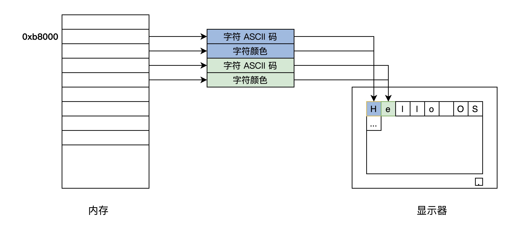
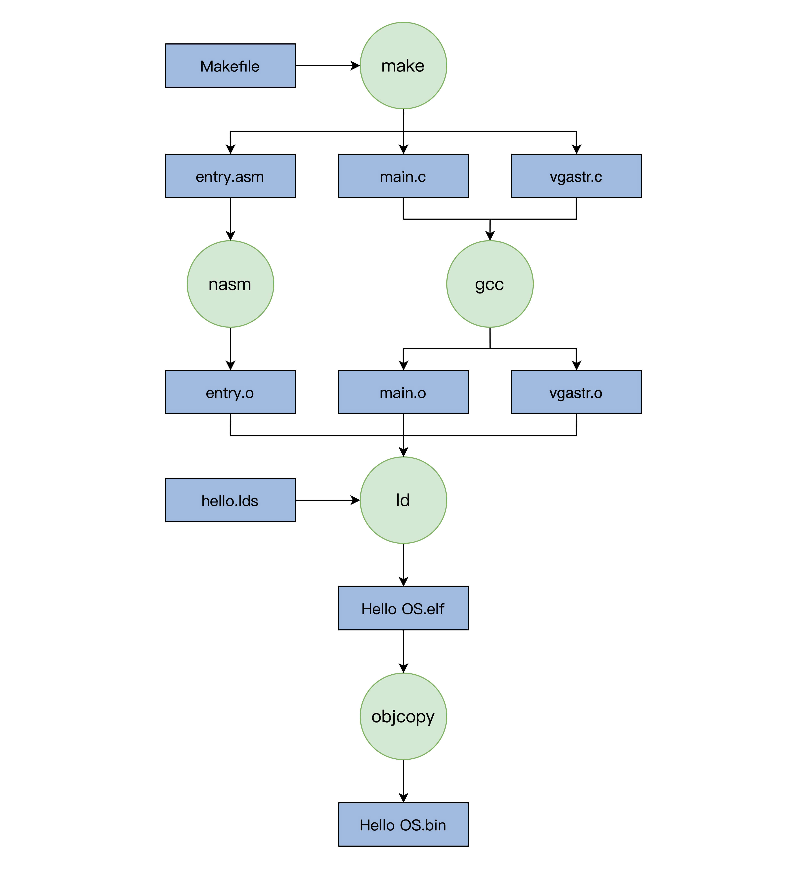

# 02 实现一个最简单的内核

写一个最小的操作系统Hello OS

## PC机的引导流程

### Hello OS的引导流程


PC机上电->PC机BIOS固件->加载可引导设备中的GRUB->GRUB引导->加载硬盘分区中的Hello OS文件->Hello OS

- PC机BIOS固件是固化在PC机主板上的ROM芯片中的，掉电也能保存，PC机上电后第一条指令就是BIOS固件中的
- 它负责检测和初始化CPU、内存及主板平台，然后加载引导设备（大概率是硬盘）中的第一个扇区数据，到0x7c00地址开始的内存空间，再接着跳转到0x7c00处执行指令，在本例中就是GRUB引导程序

### 拓展：UEFI BIOS

https://uefi.org/

## Hello OS引导汇编代码

- 为什么不能直接用C：C作为通用的高级语言，不能直接操作特定的硬件，而且C语言的函数调用、函数传参都需要用栈。栈由CPU特定的栈寄存器指向，所以要先用汇编代码处理好C语言的工作环境。

## Hello OS的主函数

main.c

main.c和entry.asm分别用GCC和nasm编译成可链接模块，由LD链接器链接在一起，形成可执行的程序文件

## 控制计算机屏幕

实现printf函数

- 计算机屏幕显示往往为显卡的输出，显卡分为集显（集成在主板的显卡），核显（做在CPU芯片内的显卡），独显（独立存在通过PCIE接口连接的显卡），性能依次上升，价格同样
- 独显往往有自己的RAM、多达几百个运算核心的处理器，不仅仅可以显示图像，而且可以执行大规模并行计算，如“挖矿”
- PC上无论何种显卡，都支持VESA标准，该标准下有两种工作模式：字符模式和图形模式。显卡为了兼容这种标准，提供VGABIOS的固件程序

### 字符工作模式

把屏幕分成24行，每行80个字符，把这（24*80）个位置映射到以0xb8000地址开始的内存中，每两个字节对应一个字符，其中一个字节是字符的ASCII码，另一个字节为字符的颜色值。



## 编译和安装Hello OS

### make工具

- make是一个工具程序，读取一个叫“makefile”的文件，文件中写好了构建软件的规则，它能够根据这些规则自动化构建软件。
- makefile文件规则：首先有一个或多个构建目标称为“target”；目标后面紧跟着用于构建该目标所需要的文件，目标下面是构建该目标所需要的命令及参数。同时，它也检查文件的依赖关系。
- 第一次构建目标后，下次执行make时，它会根据该目标所依赖的文件是否更新决定是否编译该目标，若所依赖的文件没有更新且该目标又存在，那么它便不会构建该目标。

例子：

```makefile
CC = gcc  #定义一个宏CC 等于gcc
CFLAGS = -c  #定义一个宏 CFLAGS 等于-c
OBJS_FILE = file.o file1.o file2.o file3.o file4.o  
.PHONY : all everything  #定义两个伪目标 all、everything
all : everything
everything :$(OBJS_FILE) #伪目标everything依赖于OBJS_FILE
%.o : %.c
	$(CC) $(CFLAGS) -o $@ $<
```

规则：

- “=”或“:=”，定义宏
- .PHONY，定义伪目标，不代表一个真正的文件名，在执行make时可以指定这个目标来执行其所在规则定义的命令。但是伪目标可以依赖于另一个伪目标或文件
- %，通配符

### 编译

编译过程：最终得到Hello OS.bin文件



### 安装Hello OS

- 要让GRUB能够找到Hello OS.bin文件，才能在计算机启动时加载它，这个过程称为安装。
- GRUB在启动时会加载一个grub.cfg的文本文件，其中一部分内容就是启动项。
- GRUB首先会显示启动项到屏幕，然后让我们选择启动项，最后GRUB根据启动项对应的信息，加载OS文件到内存