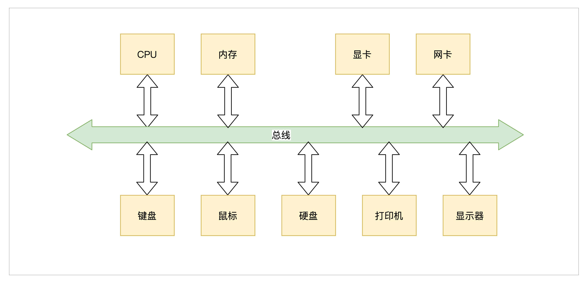
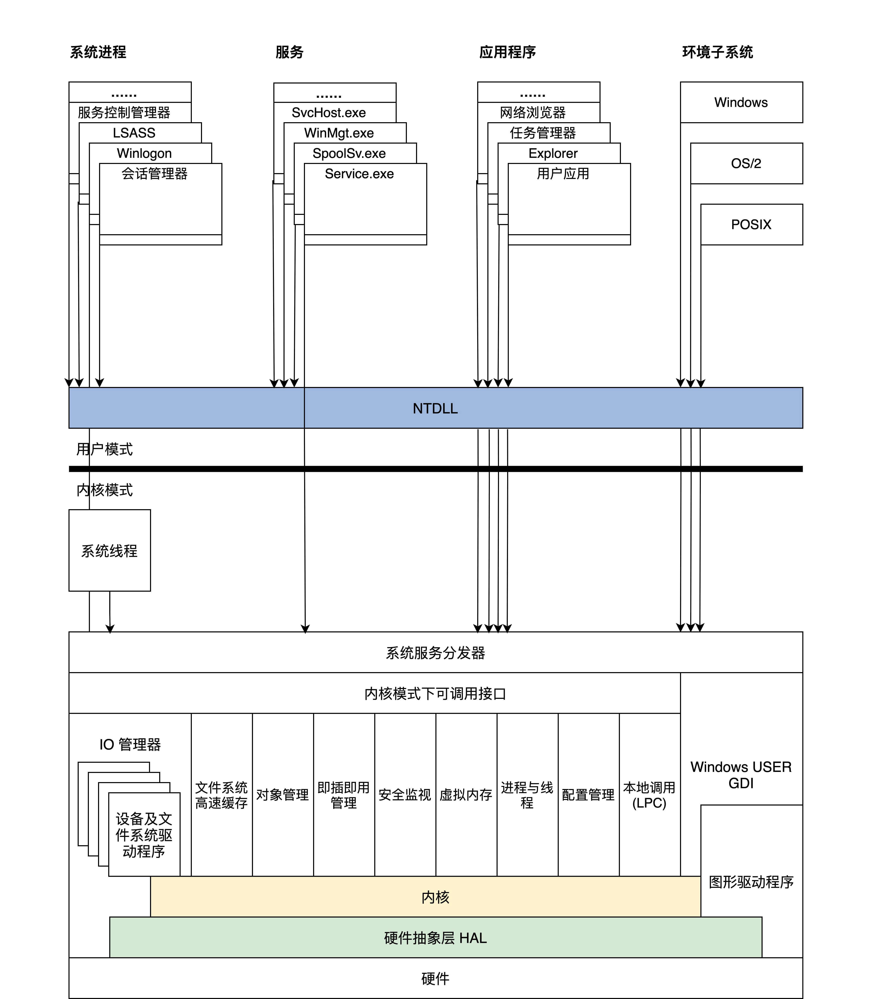

# 01 程序的运行过程：从代码到机器运行

## 程序编译过程


- 预处理：gcc HelloWorld.c -E -o HelloWorld.i， 加入头文件，替换宏
- 编译：gcc HelloWorld.i -S -c HelloWorld.o，转换成汇编程序
- 汇编：gcc HelloWorld.s -c HelloWorld.o，将汇编程序转换成可链接的二进制程序
- 链接：gcc HelloWorld.o - o，生成可执行文件

## 程序装载执行

- 图灵机
- 冯诺依曼体系结构：输入输出设备、存储器、运算器、控制器、总线

# 02 实现一个最简单的内核

写一个最小的操作系统Hello OS

## PC机的引导流程

### Hello OS的引导流程


PC机上电->PC机BIOS固件->加载可引导设备中的GRUB->GRUB引导->加载硬盘分区中的Hello OS文件->Hello OS

- PC机BIOS固件是固化在PC机主板上的ROM芯片中的，掉电也能保存，PC机上电后第一条指令就是BIOS固件中的
- 它负责检测和初始化CPU、内存及主板平台，然后加载引导设备（大概率是硬盘）中的第一个扇区数据，到0x7c00地址开始的内存空间，再接着跳转到0x7c00处执行指令，在本例中就是GRUB引导程序

### 拓展：UEFI BIOS

https://uefi.org/

## Hello OS引导汇编代码

- 为什么不能直接用C：C作为通用的高级语言，不能直接操作特定的硬件，而且C语言的函数调用、函数传参都需要用栈。栈由CPU特定的栈寄存器指向，所以要先用汇编代码处理好C语言的工作环境。

## Hello OS的主函数

main.c

main.c和entry.asm分别用GCC和nasm编译成可链接模块，由LD链接器链接在一起，形成可执行的程序文件

## 控制计算机屏幕

实现printf函数

- 计算机屏幕显示往往为显卡的输出，显卡分为集显（集成在主板的显卡），核显（做在CPU芯片内的显卡），独显（独立存在通过PCIE接口连接的显卡），性能依次上升，价格同样
- 独显往往有自己的RAM、多达几百个运算核心的处理器，不仅仅可以显示图像，而且可以执行大规模并行计算，如“挖矿”
- PC上无论何种显卡，都支持VESA标准，该标准下有两种工作模式：字符模式和图形模式。显卡为了兼容这种标准，提供VGABIOS的固件程序

### 字符工作模式

把屏幕分成24行，每行80个字符，把这（24*80）个位置映射到以0xb8000地址开始的内存中，每两个字节对应一个字符，其中一个字节是字符的ASCII码，另一个字节为字符的颜色值。


## 编译和安装Hello OS

### make工具

- make是一个工具程序，读取一个叫“makefile”的文件，文件中写好了构建软件的规则，它能够根据这些规则自动化构建软件。
- makefile文件规则：首先有一个或多个构建目标称为“target”；目标后面紧跟着用于构建该目标所需要的文件，目标下面是构建该目标所需要的命令及参数。同时，它也检查文件的依赖关系。
- 第一次构建目标后，下次执行make时，它会根据该目标所依赖的文件是否更新决定是否编译该目标，若所依赖的文件没有更新且该目标又存在，那么它便不会构建该目标。

例子：

```makefile
CC = gcc  #定义一个宏CC 等于gcc
CFLAGS = -c  #定义一个宏 CFLAGS 等于-c
OBJS_FILE = file.o file1.o file2.o file3.o file4.o  
.PHONY : all everything  #定义两个伪目标 all、everything
all : everything
everything :$(OBJS_FILE) #伪目标everything依赖于OBJS_FILE
%.o : %.c
	$(CC) $(CFLAGS) -o $@ $<
```

规则：

- “=”或“:=”，定义宏
- .PHONY，定义伪目标，不代表一个真正的文件名，在执行make时可以指定这个目标来执行其所在规则定义的命令。但是伪目标可以依赖于另一个伪目标或文件
- %，通配符

### 编译

编译过程：最终得到Hello OS.bin文件


### 安装Hello OS

- 要让GRUB能够找到Hello OS.bin文件，才能在计算机启动时加载它，这个过程称为安装。
- GRUB在启动时会加载一个grub.cfg的文本文件，其中一部分内容就是启动项。
- GRUB首先会显示启动项到屏幕，然后让我们选择启动项，最后GRUB根据启动项对应的信息，加载OS文件到内存

## 问题

- makefile
- 通过grub查找/boot所在的分区
- 未解决：选择HelloOS报错：'Secure Boot forbids loading module from (hd2,gpt1)/boot/grub/x86_64-efi/multiboot2.mod. you need to load the kernel first'

# 03 内核结构与设计

## 内核内部组成逻辑

内核可以看作是计算机资源的管理者

### 计算机资源

硬件资源：

- 总线
- CPU，中央处理器，负责执行程序和处理数据运算
- 内存，负责存储运行时的代码和数据
- 硬盘，负责长久存储用户文件数据
- 网卡，负责计算机与其他设备之间的通信
- 显卡
- I/O设备



软件资源：文件、软件程序等

### 内核组成逻辑

1. 管理CPU，CPU执行程序，内核把运行时的程序抽象成进程，又称为进程管理
2. 管理内存，分配、释放内存
3. 管理硬盘，银盘主要存放用户数据，内核将用户数据抽象成文件，形成文件系统
4. 管理显卡，图形系统
5. 管理网卡，网络协议栈，又称网络组件
6. 管理I/O设备，I/O管理器
7. 安全组件

**硬件驱动**

## 经典内核结构

### 宏内核结构

把上述功能模块的代码经过编译，最后链接在一起，形成一个大的可执行程序，向用户应用软件提供一些接口（API），而达成许会在处理器的特权模式下运行，通常称为宏内核模式。


宏内核结构缺点：没有模块化，各个模块高度耦合，没有拓展性和可移植性。开发一个新的功能就要重新编译、链接、安装内核。

优点：性能好，各个组件可以相互调用，性能极高

### 微内核结构

提倡内核功能尽可能少：仅有进程调度、处理中断、内存空间映射、进程间通信等，把实际的进程管理、文件管理、设备管理、内存管理等服务功能，作成一个个服务进程。和用户进程一样。

微内核定义了一种良好的进程间通信的机制——消息。


微内核优点：系统结构清晰利于协作开发；有良好的移植性；有良好的伸缩性、扩展性，因为那些系统功能只是一个进程，可以随时减少或增加

代表：MACH、MINIX、L4

缺点：性能差

## 分离硬件的相关性

系统内核分层，把操作硬件和处理硬件功能差异的代码抽离出来，形成一个独立的软件抽象层，对外提供相应的接口，方便上层开发

- 好处：屏蔽底层细节，，使上层开发更简单。
- 基本方法：增加一个抽象层

## 设计一个操作系统内核（混合内核）

### 混合内核

KML：https://www.cnblogs.com/call-me-dasheng/p/14343705.html

内核模块，也称为可加载内核模块(LKM)，对于保持内核在不消耗所有可用内存的情况下与所有硬件一起工作是必不可少的。

模块通常向基本内核添加设备、文件系统和系统调用等功能。lkm的文件扩展名是.ko，通常存储在/lib/modules目录中。由于模块的特性，可以通过在启动时使menuconfig命令将模块设置为load或not load，或者通过编辑/boot/config文件，或者使用modprobe命令动态地加载和卸载模块，轻松定制内核。

Ubuntu中的内核文件存储在/boot文件夹中，称为vmlinux -version。

### 分层

- 内核接口层：定义一系列接口
  - 定义一套UNIX接口的子集
  - 检查其参数是否合法，参数有问题则返回相关的错误，调用下层完成功能的核心代码
- 内核功能层：完成各种实际功能
  - 进程管理：实现进程的创建、销毁和调度
  - 内存管理：页面内存池和任意大小的内存池
  - 中断管理：把中断回调函数安插到相关的数据结构中，一旦发生相关的中断就会调用该函数
  - 设备管理：用一系列的数据结构表示驱动程序模块、驱动程序本身、驱动程序创建的设备，最后组织在一起，实现创建、销毁、访问设备的代码，代码最终会调用设备驱动程序，从而操作设备
- 内核硬件层：主要包括一个硬件平台相关的代码
  - 初始化：初始化代码是内核被加载到内存中最先需要运行的代码，例如初始化少量设备、CPU、内存、中断的控制、内核用于管理的数据结构等
  - CPU控制：提供CPU模式设定、开关中断、读写CPU特定寄存器等功能的代码
  - 中断处理：保存中断时机器的上下文，调用中断回调函数，操作中断控制器等
  - 物理内存管理：提供分配、释放大块内存，内存空间映射，操作MMU、Cache等
  - 其他硬件平台相关的特殊功能


# 04 业界成熟的内核架构

## Linux内核

- 全称GNU/Linux，是一套免费使用和自由传播的操作系统，支持类UNIX、POSIX标准接口，也支持多用户、多进程、多线程，可以在多CPU的机器上运行。
- Liunx系统性能稳定且开源
- 所见皆文件


**五大重要组件**


- Linux模块之间的通信主要是函数调用，而且函数间的调用没有一定的层次关系，也没有左右边界的限定，函数的调用路径是纵横交错的
- 只要有一个函数出了问题，就会波及到全部组件，导致整个系统崩溃
- 模块之间没有隔离，安全隐患也是巨大的
- 优点是性能极高

## 对比Windows和macOS

### Darwin-XNU内核

Darwin使用了一种微内核（Mach）和相应的固件来支持不同的处理器平台，并提供操作系统原始的基础服务，上层的功能性系统服务和工具则是整合了BSD系统所提供的。

Darwin架构：两个内核层——Mach层和BSD层


Mach内核是卡耐基梅梅隆大学开发的经典微内核，意在提供最基本的操作系统服务，从而达到高性能、安全、可扩展的目的，而BSD则是伯克利大学开发的类UNIX操作系统，提供一整套操作系统服务。因为性能和兼容，保留Mach，加入了BSD


### Windows NT内核


**高内聚、低耦合**




## 总结

- Linux性能良好，结构异常复杂，不利于问题的排查和功能的扩展，宏内核
- Darwin-XNU（多核）和Windows（混合内核）结构良好，层面分明，利于功能扩展，不容易产生问题且性能稳定
- 宏内核相当于所有的功能都耦合在一起，放在内核内；微内核是把大多数功能解耦出来，放在用户态，使用IPC在用户态调用服务进程。混合结构其实与微内核相似，只不过解耦出来的这些功能依然放在内核里；内核模块是可以动态加载和卸载的。

# 05 CPU工作模式：执行程序的三种模式

按照CPU功能升级迭代的顺序，工作模式有**实模式、保护模式、长模式**

## 实模式（实地址模式）

- 运行真实的指令，对指令的动作不做区分，直接执行指令的真实功能
- 发往内存的地址是真实的，对任何地址不加限制的发往内存

### 实模式寄存器

CPU是根据指令完成相应的功能，指令的操作数，可以是寄存器、内存地址、常数，通常情况下是寄存器

x86 CPU在实模式下的寄存器，16位


### 实模式下访问内存

数据和指令都是存放在内存中的。取指令、访问内存数据都要访问内存

内存地址计算（分段内存管理模型）：段寄存器左移4位，加上一个通用寄存器中的值或常数形成地址，代码段由CS和IP确定的，栈段由SS和SP段确定的


```assembly
data SEGMENT ;定义一个数据段存放Hello World！
	hello DB 'Hello World!$'   ;要以$结束
data ENDS
code SEGMENT ;定义一个代码段存放程序指令
	ASSUME CS:CODE,DS:DATA ;DS指向数据段，CS指向代码段
start:
	MOV AX,data  ;将data段首地址赋值给AX
	MOV DS,AX    ;将AX赋值给DS，使DS指向data段
	LEA DX,hello ;使DX指向hello首地址
	MOV AH,09h   ;给AH设置参数09H，AH是AX高8位，AL是AX低8位
	INT 21h      ;执行DOS中断输出DS指向的DX指向的字符串hello
	MOV AX,4C00h ;给AH设置参数4C00h
	INT 21h      ;调用4C00h号功能，结束程序
code ENDS
ENDS start
```

### 实模式中断

- 先保存CS和IP寄存器，然后装载新的CS和IP寄存器

中断如何产生：

- 硬件中断：中断控制器给CPU发送了一个电子信号，CPU对这个信号做出应答
- 软件中断：CPU执行INT指令，指令后面会跟随一个常数，即软件中断号

中断向量表：表的地址和长度由CPU的特定寄存器IDTR指向，实模式下，表中的一个条目由代码段地址和段内偏移组成。

CPU获得中断号以后，根据IDTR寄存器中的信息，计算出中断向量中的条目，进而装载CS（装入代码段基地址）、IP（装入代码段内偏移）寄存器，最终响应中断。


## 保护模式

随着软件规模不断增加，需要更高的计算量、更大的内存容量。首先要解决的问题就是**寻址问题**。因为16位的寄存器最多只能表示 2^16 个地址，所以CPU的寄存器和运算单元都要扩展成32位的。


基于上述原因，CPU实现了保护模式。

### 保护模式寄存器

相对于实模式，保护模式增加了一些控制寄存器和段寄存器，扩展通用寄存器的位宽，所有的通用寄存器都是32位的，还可以单独使用低16位，低16位又可以拆分成两个8位寄存器。


### 保护模式特权级

区分指令和资源使用等级，4级，R0～R3，R0可以执行所有指令，R1、R2、R3等级依次递减，高特权级可以访问低特权级的资源，内存访问则是靠段描述符和特权级相互配合去实现的。

### 保护模式段描述符

目前为止，内存还是分段模型，要对内存进行保护，就可以转换成对段的保护。

由于CPU的扩展导致了32位的段基地址和段内偏移，还有一些其他信息，所以16位的段寄存器肯定放不下，需要把描述一个段的信息封装成特定格式的**段描述符**，放在**内存**中。

一个段描述符有64位8字节数据，包含段基地址、段长度、段权限、段类型（系统段、代码段、数据段）、是否可读写、可执行等，如下图。


多个段描述符在内存中形成全局段描述符表（如下图），该表的基地址和长度由CPU和GDTR寄存器指示。段寄存器不再存放段基地址，而是具体段描述符的索引，访问一个内存地址时，段寄存器中的索引首先会结合GDTR寄存器找到内存中的段描述符，再根据其中的段信息判断能不能访问成功。


### 保护模式段选择子

CS、DS、ES、SS、FS、GS这些段寄存器中存放的不止是内存段的描述符索引，还有影子寄存器、段描述符索引、描述符表索引、权限级别，称为保护模式段选择子


### 保护模式平坦模型


```assembly
GDT_START:
knull_dsc: dq 0
;第一个段描述符CPU硬件规定必须为0
kcode_dsc: dq 0x00cf9e000000ffff
;段基地址=0，段长度=0xfffff
;G=1,D/B=1,L=0,AVL=0 
;P=1,DPL=0,S=1
;T=1,C=1,R=1,A=0
kdata_dsc: dq 0x00cf92000000ffff
;段基地址=0，段长度=0xfffff
;G=1,D/B=1,L=0,AVL=0 
;P=1,DPL=0,S=1
;T=0,C=0,R=1,A=0
GDT_END:

GDT_PTR:
GDTLEN  dw GDT_END-GDT_START-1
GDTBASE  dd GDT_START
```

### 保护模式中断

- 实模式下CPU不需要做权限检查，所以可以直接通过中断向量表中的值装载CS:IP寄存器；

- 而保护模式下的中断要权限检查，还有特权级切换，所以就需要扩展中断向量表的信息，即每个中断向量表用一个中断门描述符来表示，也可简称为中断门，如下图

  

- 同样的，保护模式要实现中断，也必须在内存中有一个中断向量表，同样是由IDTR寄存器指向，如下图

  

- 产生中断后，CPU首先会检查中断号是否大于**最后一个中断门描述符**，x86 CPU最大支持256个中断源（即中断号：0～255），然后检查描述符类型（是否中断门或陷阱门）、是否为系统描述符，是否存在于内存中

- 接着检查中断门描述符中的段选择子指向的段描述符

- 最后做权限检查，如果CPL小于等于中断门的DPL并且CPL大于等于中断门中的段选择子，就指向段描述符的DPL

- 进一步的，CPL等于中断门中的段选择子指向段描述符的DPL，则为同级权限，不进行栈切换，否则进行栈切换。如果进行栈切换，还需要从TSS中加载具体权限的SS、ESP，还要对SS中段选择子指向的段描述符进行检查

- 完成上述检查后，CPU才会加载中断门描述符中目标代码段选择子到CS寄存器中，把目标代码段偏移加载到EIP寄存器中

## 长模式（AMD64）

使 CPU 在现有的基础上有了 64 位的处理能力，既能完成 64 位的数据运算，也能寻址 64 位的地址空间。这在大型计算机上犹为重要，因为它们的物理内存通常有几百 GB。

### 长模式寄存器

- 相对于保护模式，增加了一些通用寄存器，并扩展通用寄存器的位宽，所有的通用寄存器都是 64 位，还可以单独使用低 32 位。
- 低 32 位可以拆分成一个低 16 位寄存器，低 16 位又可以拆分成两个 8 位寄存器，如下表。


### 长模式段描述符

长模式依然具备保护模式绝大多数特性，如特权级和权限检查。


在长模式下，CPU 不再对段基址和段长度进行检查，只对 DPL 进行相关的检查，这个检查流程和保护模式下一样。当描述符中的 L=1，D/B=0 时，就是 64 位代码段，DPL 还是 0~3 的特权级。然后有多个段描述在内存中形成一个全局段描述符表，同样由 CPU 的 GDTR 寄存器指向。

```assembly
ex64_GDT:
null_dsc:  dq 0
;第一个段描述符CPU硬件规定必须为0
c64_dsc:dq 0x0020980000000000  ;64位代码段
;无效位填0
;D/B=0,L=1,AVL=0 
;P=1,DPL=0,S=1
;T=1,C=0,R=0,A=0
d64_dsc:dq 0x0000920000000000  ;64位数据段
;无效位填0
;P=1,DPL=0,S=1
;T=0,C/E=0,R/W=1,A=0
eGdtLen   equ $ - null_dsc  ;GDT长度
eGdtPtr:dw eGdtLen - 1  ;GDT界限
     dq ex64_GDT
```

段长度和段基址都是无效的填充为 0，CPU 不做检查。但是上面段描述符的 DPL=0，这说明需要最高权限即 CPL=0 才能访问。若是数据段的话，G、D/B、L 位都是无效的。

### 长模式中断

保护模式下为了实现对中断进行权限检查，实现了中断门描述符，在中断门描述符中存放了对应的段选择子和其段内偏移，还有 DPL 权限，如果权限检查通过，则用对应的段选择子和其段内偏移装载 CS:EIP 寄存器。其中断门描述符中段内偏移只有32位。

长模式支持64位内存寻址，所以要对中断门描述符进行修改和扩展，中断门描述符的格式如下图


**变化**

- 为了支持 64 位寻址中断门描述符在原有基础上增加 8 字节，用于存放目标段偏移的高 32 位值；
- 目标代码段选择子对应的代码段描述符必须是 64 位的代码段；
-  IST 是 64 位 TSS 中的 IST 指针；
- 长模式也同样在内存中有一个中断门描述符表，只不过表中的条目（如上图所示）是 16 字节大小，最多支持 256 个中断源，对中断的响应和相关权限的检查和保护模式一样。

## 模式切换

### 实模式切换到保护模式

x86 CPU 在第一次加电和每次 reset 后，都会自动进入实模式，要想进入保护模式，就需要程序员写代码实现从实模式切换到保护模式。切换到保护模式的步骤如下：

1. 准备全局段描述附表

```assembly
GDT_START:
knull_dsc: dq 0
kcode_dsc: dq 0x00cf9e000000ffff
kdata_dsc: dq 0x00cf92000000ffff
GDT_END:
GDT_PTR:
GDTLEN  dw GDT_END-GDT_START-1
GDTBASE  dd GDT_START
```

2. 加载设置 GDTR 寄存器，使之指向全局段描述符表

   ```assembly
   lgdt [GDT_PTR]
   ```

3. 设置 CR0 寄存器，开启保护模式。

   ```assembly
   ;开启 PE
   mov eax, cr0
   bts eax, 0                      
   ; CR0.PE =1
   mov cr0, eax
   ```

   ​         

4. 第四步，进行长跳转，加载 CS 段寄存器，即段选择子。

   ```assembly
   jmp dword 0x8 :_32bits_mode ;_32bits_mode为32位代码标号即段偏移
   ```

   - 为什么要进行长跳转：因为无法直接或间接 mov 一个数据到 CS 寄存器中，刚刚开启保护模式时，CS 的影子寄存器还是实模式下的值，所以需要告诉 CPU 加载新的段信息。

5. CPU 发现了 CRO 寄存器第 0 位的值是 1，就会按 GDTR 的指示找到全局描述符表，然后根据索引值 8，把新的段描述符信息加载到 CS 影子寄存器，当然这里的前提是进行一系列合法的检查。

6. 到此为止，CPU 真正进入了保护模式，CPU 也有了 32 位的处理能力。

### 实模式切换到长模式

1. 准备长模式全局段描述符表

   ```assembly
   ex64_GDT:
   null_dsc:  dq 0
   ;第一个段描述符CPU硬件规定必须为0
   c64_dsc:dq 0x0020980000000000  ;64位代码段
   d64_dsc:dq 0x0000920000000000  ;64位数据段
   eGdtLen   equ $ - null_dsc  ;GDT长度
   eGdtPtr:dw eGdtLen - 1  ;GDT界限
        dq ex64_GDT
   ```

2. 准备长模式下的 MMU 页表，这个是为了开启分页模式，切换到长模式必须要开启分页。长模式下已经不对段基址和段长度进行检查了，那么内存地址空间就得不到保护了。而长模式下内存地址空间的保护交给了 MMU，MMU 依赖页表对地址进行转换，页表有特定的格式存放在内存中，其地址由 CPU 的 CR3 寄存器指向。

   ```assembly
   mov eax, cr4
   bts eax, 5   ;CR4.PAE = 1
   mov cr4, eax ;开启 PAE
   mov eax, PAGE_TLB_BADR ;页表物理地址
   mov cr3, eax
   ```

3. 加载 GDTR 寄存器，使之指向全局段描述表

   ```assembly
   lgdt [eGdtPtr]
   ```

4. 开启长模式，要同时开启保护模式和分页模式，在实现长模式时定义了 MSR 寄存器，需要用专用的指令 rdmsr、wrmsr 进行读写，IA32_EFER 寄存器的地址为 0xC0000080，它的第 8 位决定了是否开启长模式。

   ```assembly
   ;开启 64位长模式
   mov ecx, IA32_EFER
   rdmsr
   bts eax, 8  ;IA32_EFER.LME =1
   wrmsr
   ;开启 保护模式和分页模式
   mov eax, cr0
   bts eax, 0    ;CR0.PE =1
   bts eax, 31
   mov cr0, eax 
   ```

5. 进行跳转，加载 CS 段寄存器，刷新其影子寄存器。

   ```assembly
   jmp 08:entry64 ;entry64为程序标号即64位偏移地址
   ```

切换到长模式和切换保护模式的流程差不多，只是需要准备的段描述符有所区别，还有就是要注意同时开启保护模式和分页模式。

## 总结

1. 实模式，早期 CPU 是为了支持单道程序运行而实现的，单道程序能掌控计算机所有的资源，早期的软件规模不大，内存资源也很少，所以实模式极其简单，仅支持 16 位地址空间，分段的内存模型，对指令不加限制地运行，对内存没有保护隔离作用。

   实模式下的寻址空间与地址总线相关。

2. 保护模式，随着多道程序的出现，就需要操作系统了。内存需求量不断增加，所以 CPU 实现了保护模式以支持这些需求。

   保护模式包含特权级，对指令及其访问的资源进行控制，对内存段与段之间的访问进行严格检查，没有权限的绝不放行，对中断的响应也要进行严格的权限检查，扩展了 CPU 寄存器位宽，使之能够寻址 32 位的内存地址空间和处理 32 位的数据，从而 CPU 的性能大大提高。

3. 长模式，又名 AMD64 模式，最早由 AMD 公司制定。由于软件对 CPU 性能需求永无止境，所以长模式在保护模式的基础上，把寄存器扩展到 64 位同时增加了一些寄存器，使 CPU 具有了能处理 64 位数据和寻址 64 位的内存地址空间的能力。

   长模式弱化段模式管理，只保留了权限级别的检查，忽略了段基址和段长度，而地址的检查则交给了 MMU。

# 06 程序中的地址如何转换

## 多程序并发场景

如果一台计算机的内存中只运行一个程序 A，这种方式正好用 CPU 的实模式来运行，因为程序 A 的地址在链接时就可以确定，例如从内存地址 0x8000 开始，每次运行程序 A 都装入内存 0x8000 地址处开始运行，没有其它程序干扰。

现在改变一下，内存中又放一道程序 B，程序 A 和程序 B 各自运行一秒钟，如此循环，直到其中之一结束。这个新场景下就会产生一些问题，当然这里我们只关心内存相关的这几个核心问题。

1. 谁来保证程序 A 跟程序 B 没有内存地址的冲突？换句话说，就是程序 A、B 各自放在什么内存地址，这个问题是由 A、B 程序协商，还是由操作系统决定。
2. 怎样保证程序 A 跟程序 B 不会互相读写各自的内存空间？这个问题相对简单，用保护模式就能解决。
3. 如何解决内存容量问题？程序 A 和程序 B，在不断开发迭代中程序代码占用的空间会越来越大，导致内存装不下。
4. 还要考虑一个扩展后的复杂情况，如果不只程序 A、B，还可能有程序 C、D、E、F、G……它们分别由不同的公司开发，而每台计算机的内存容量不同。这时候，又对我们的内存方案有怎样的影响呢？

要想完美地解决以上最核心的 4 个问题，一个较好的方案是：让所有的程序都各自享有一个从 0 开始到最大地址的空间，这个地址空间是独立的，是该程序私有的，其它程序既看不到，也不能访问该地址空间，这个地址空间和其它程序无关，和具体的计算机也无关。这个方案就是虚拟地址。

## 虚拟地址

- 虚拟地址是逻辑上存在的一个数据值，比如 0~100 就有 101 个整数值，这个 0~100 的区间就可以说是一个虚拟地址空间，该虚拟地址空间有 101 个地址；
- 每个应用程序的虚拟地址空间都是相同且独立的；
- 虚拟地址是由链接器产生的：开发软件经过编译步骤后，就需要链接成可执行文件才可以运行，而链接器的主要工作就是把多个代码模块组装在一起，并解决模块之间的引用，即处理程序代码间的地址引用，形成程序运行的静态内存空间视图；
- 虚拟地址独立且统一，根据操作系统的不同，虚拟地址空间的定义也许不同。

## 物理地址

- 虚拟地址只是逻辑上存在的地址，无法作用于硬件电路。
- 程序装进内存中想要执行，就需要和内存打交道，从内存中取得指令和数据。而内存只认一种地址，那就是物理地址。
- 物理地址在逻辑上也是一个数据，只不过这个数据会被地址译码器等电子器件变成电子信号，放在地址总线上，地址总线电子信号的各种组合就可以选择到内存的储存单元了。
- 地址总线上的信号即物理地址，也可以选择到别的设备中的储存单元，如显卡中的显存、I/O 设备中的寄存器、网卡上的网络帧缓存器。如果不做特别说明，物理地址就是指选择内存单元的地址。

## 虚拟地址到物理地址的转换

- 使用软硬结合的方式实现，即MMU（内存管理单元），接收软件给出的地址对应关系数据，进行地址转换，工作原理如下图：

  

- 将0x80000～0x84000的虚拟地址空间转换成0x10000～0x14000的物理地址空间，而地址关系转换表本身则是放在物理内存中的；

- 问题：如果在地址关系转换表中，一个虚拟地址对应一个物理地址。那么32 位地址空间下，4GB 虚拟地址的地址关系转换表就会把整个 32 位物理地址空间用完，这显然不行。而要是结合前面的保护模式下分段方式，地址关系转换表中存放：一个虚拟段基址对应一个物理段基址，这样看似可以，但是因为段长度各不相同（段长度由段描述符设定），所以依然不可取；

- 解决：把虚拟地址空间和物理地址空间都分成同等大小的块，也称为页，按照虚拟页和物理页进行转换。根据软件配置不同，这个页的大小可以设置为 4KB、2MB、4MB、1GB，这就是现代内存管理模式——分页模型。框架如下图

  

- 一个虚拟页对应一个物理页，在地址关系转换表中，只要存放虚拟页地址对应的物理地址即可

## MMU（内存管理单元）

- 是用硬件电路逻辑实现的一个地址转换器件，它负责接受虚拟地址和地址关系转换表，以及输出物理地址。
- MMU 可以是独立的芯片，也可以是集成在其它芯片内部的，比如集成在 CPU 内部，x86、ARM 系列的 CPU 就是将 MMU 集成在 CPU 核心中的。
- SUN 公司的 CPU 是将独立的 MMU 芯片卡在总线上的，有一夫当关的架势。下面我们只研究 x86  CPU 中的 MMU。x86 CPU 要想开启 MMU，就必须先开启保护模式或者长模式，实模式下是不能开启 MMU 的。由于保护模式的内存模型是分段模型，它并不适合于 MMU 的分页模型，所以我们要使用保护模式的平坦模式，这样就绕过了分段模型。这个平坦模型和长模式下忽略段基址和段长度是异曲同工的。地址产生的过程如下所示。CPU地址转换图上图中，程序代码中的虚拟地址，经过 CPU 的分段机制产生了线性地址，平坦模式和长模式下线性地址和虚拟地址是相等的。如果不开启 MMU，在保护模式下可以关闭 MMU，这个线性地址就是物理地址。因为长模式下的分段弱化了地址空间的隔离，所以开启 MMU 是必须要做的，开启 MMU 才能访问内存地址空间。

### MMU页表

- 描述了虚拟地址到物理地址的转换关系，也可以说是虚拟页到物理页的映射关系，所以称为页表。

- 为了增加灵活性和节约物理内存空间（因为页表是放在物理内存中的），所以页表中并不存放虚拟地址和物理地址的对应关系，只存放物理页面的地址，MMU 以虚拟地址为索引去查表返回物理页面地址，而且页表是分级的，总体分为三个部分：一个顶级页目录，多个中级页目录，最后才是页表，逻辑结构图如下

  

- 一个虚拟地址被分成从左至右四个位段。

- 工作流程：第一个位段索引顶级页目录中一个项，该项指向一个中级页目录，然后用第二个位段去索引中级页目录中的一个项，该项指向一个页目录，再用第三个位段去索引页目录中的项，该项指向一个物理页地址，最后用第四个位段作该物理页内的偏移去访问物理内存。

- 分页模式优点：灵活性、通用性】安全性

## 保护模式下的分页

- 保护模式下只有 32 位地址空间，最多 4GB-1 大小的空间。
- 32 位虚拟地址经过分段机制之后得到线性地址，又因为通常使用平坦模式，所以线性地址和虚拟地址是相同的。
- 保护模式下的分页大小通常有两种，一种是 4KB 大小的页，一种是 4MB 大小的页。分页大小的不同，会导致虚拟地址位段的分隔和页目录的层级不同，但虚拟页和物理页的大小始终是等同的

### 4KB页

该分页方式下，32 位虚拟地址被分为三个位段：页目录索引、页表索引、页内偏移，只有一级页目录，其中包含 1024 个条目 ，每个条目指向一个页表，每个页表中有 1024 个条目。其中一个条目就指向一个物理页，每个物理页 4KB。这正好是 4GB 地址空间。如下图所示。


上图中 CR3 就是 CPU 的一个 32 位的寄存器，MMU 就是根据这个寄存器找到页目录的。下面，我们看看当前分页模式下的 CR3、页目录项、页表项的格式。


页目录项、页表项都是 4 字节 32 位，1024 个项正好是 4KB（一个页），因此它们的地址始终是 4KB 对齐的，所以低 12 位才可以另作它用，形成了页面的相关属性，如是否存在、是否可读可写、是用户页还是内核页、是否已写入、是否已访问等。

### 4MB页

该分页方式下，32 位虚拟地址被分为两个位段：页表索引、页内偏移，只有一级页目录，其中包含 1024 个条目。其中一个条目指向一个物理页，每个物理页 4MB，正好为 4GB 地址空间，如下图所示。


CR3 还是 32 位的寄存器，只不过不再指向顶级页目录了，而是指向一个 4KB 大小的页表，这个页表依然要 4KB 地址对齐，其中包含 1024 个页表项，格式如下图。


## 长模式下的分页

如果开启了长模式，则必须同时开启分页模式，因为长模式弱化了分段模型，而分段模型也确实有很多不足，不适应现在操作系统和应用软件的发展。

同时，长模式也扩展了 CPU 的位宽，使得 CPU 能使用 64 位的超大内存地址空间。

所以，长模式下的虚拟地址必须等于线性地址且为 64 位。长模式下的分页大小通常也有两种，4KB 大小的页和 2MB 大小的页。

### 4KB页

该分页方式下，64 位虚拟地址被分为 6 个位段，分别是：保留位段，顶级页目录索引、页目录指针索引、页目录索引、页表索引、页内偏移，顶级页目录、页目录指针、页目录、页表各占有 4KB 大小，其中各有 512 个条目，每个条目 8 字节 64 位大小，如下图所示。


上面图中 CR3 已经变成 64 位的 CPU 的寄存器，它指向一个顶级页目录，里面的顶级页目项指向页目录指针，依次类推。

需要注意的是，虚拟地址 48 到 63 这 16 位是根据第 47 位来决定的，47 位为 1，它们就为 1，反之为 0，这是因为 x86 CPU 并没有实现全 64 位的地址总线，而是只实现了 48 位，但是 CPU 的寄存器却是 64 位的。这种最高有效位填充的方式，即使后面扩展 CPU 的地址总线也不会有任何影响。

当前分页模式下的 CR3、顶级页目录项、页目录指针项、页目录项、页表项的格式如下图。


长模式下的 4KB 分页下，由一个顶层目录、二级中间层目录和一层页表组成了 64 位地址翻译过程。顶级页目录项指向页目录指针页，页目录指针项指向页目录页，页目录项指向页表页，页表项指向一个 4KB 大小的物理页，各级页目录项中和页表项中依然存在各种属性位，这在图中已经说明。其中的 XD 位，可以控制代码页面是否能够运行。

### 2MB页

在这种分页方式下，64 位虚拟地址被分为 5 个位段 ：保留位段、顶级页目录索引、页目录指针索引、页目录索引，页内偏移，顶级页目录、页目录指针、页目录各占有 4KB 大小，其中各有 512 个条目，每个条目 8 字节 64 位大小。


长模式下 2MB 和 4KB 分页的区别是，2MB 分页下是页目录项直接指向了 2MB 大小的物理页面，放弃了页表项，然后把虚拟地址的低 21 位作为页内偏移，21 位正好索引 2MB 大小的地址空间。

2MB 分页模式下的 CR3、顶级页目录项、页目录指针项、页目录项的格式如下图。


上图中没有了页表项，取而代之的是，页目录项中直接存放了 2MB 物理页基地址。由于物理页始终 2MB 对齐，所以其地址的低 21 位为 0，用于存放页面属性位。

## 开启MMU

要使用分页模式就必先开启 MMU，但是开启 MMU 的前提是 CPU 进入保护模式或者长模式

开启 MMU步骤如下：

1. 使CPU进入保护模式或长模式

2. 准备好页表数据，这包含顶级页目录，中间层页目录，页表，假定我们已经写了代码，在物理内存中生成了这些数据

3. 把顶级页目录的物理内存地址赋值给 CR3 寄存器。

   ```assembly
   mov eax, PAGE_TLB_BADR ;页表物理地址
   mov cr3, eax
   ```

4. 设置 CPU 的 CR0 的 PE 位为 1，这样就开启了 MMU。

   ```assembly
   ;开启 保护模式和分页模式
   mov eax, cr0
   bts eax, 0    ;CR0.PE =1
   bts eax, 31   ;CR0.P = 1
   mov cr0, eax 
   ```

## MMU地址转换失败

可能情况：页表项中的数据为空，用户程序访问了超级管理者的页面，向只读页面中写入数据。这些都会导致 MMU 地址转换失败。

1. 访问了受内核保护的页面（或只读的页面），如c语言中存储字符串字面量和const变量的段，此时内核会抛出段错误
2. 页面和页表没有产生映射关系，但是数据页已经被其他进程加载到内存中了，此时只要建立页面和页表的映射关系，称为次级缺页中断
3. 页面和页表没有产生映射关系，数据页也没有被加载到内存中（在磁盘上），此时需要发生磁盘io从磁盘中加载页到内存中，还需要建立页面和页表的映射关系，称为严重缺页中断
4. 2、3都会以内核降低自身运行速度来修复，即通过中断形成页表映射，然后再重新执行引起中断的命令

处理：

1. MMU 停止转换地址。
2. MMU 把转换失败的虚拟地址写入 CPU 的 CR2 寄存器。
3. MMU 触发 CPU 的 14 号中断，使 CPU 停止执行当前指令。
4. CPU 开始执行 14 号中断的处理代码，代码会检查原因，处理好页表数据返回。
5. CPU 中断返回继续执行 MMU 地址转换失败时的指令。

## 总结

- 在分页模式下，操作系统是如何对应用程序的地址空间进行隔离的？

  


# 07 Cache与内存：程序存放位置

## 程序局部性原理

代码的结构主要是顺序、分支、循环

程序一旦编译装载进内存中，它的地址就确定了。也就是说，CPU大多数时间在访问相同或与此相邻的地址，换句话说就是：CPU大多数时间在执行相同的指令或与此相邻的指令，即**程序局部性原理**

## 内存

内存也称为主存，不管硬盘多大、里面存放了多少程序和数据，只要程序运行或者数据要进行计算处理，就必须先将它们装入内存。


从上图可以看到在 PCB 板上有内存颗粒芯片，主要是用来存放数据的。SPD 芯片用于存放内存自身的容量、频率、厂商等信息。还有最显眼的金手指，用于连接数据总线和地址总线，电源等。其实从专业角度讲，内存应该叫 DRAM，即动态随机存储器。内存储存颗粒芯片中的存储单元是由电容和相关元件做成的，电容存储电荷的多、少代表数字信号 0 和 1。而随着时间的流逝，电容存在漏电现象，这导致电荷不足，就会让存储单元的数据出错，所以 DRAM 需要周期性刷新，以保持电荷状态。DRAM 结构较简单且集成度很高，通常用于制造内存条中的储存颗粒芯片。虽然内存技术标准不断更新，但是储存颗粒的内部结构没有本质改变，还是电容存放电荷，标准看似更多，实际上只是提升了位宽、工作频率，以及传输时预取的数据位数。比如 DDR SDRAM，即双倍速率同步动态随机存储器，它使用 2.5V 的工作电压，数据位宽为 64 位，核心频率最高为 166MHz。下面简称 DDR 内存，它表示每一个时钟脉冲传输两次数据，分别在时钟脉冲的上升沿和下降沿各传输一次数据，因此称为双倍速率的 SDRAM。后来的 DDR2、DDR3、DDR4 也都在核心频率和预取位数上做了提升。最新的 DDR4 采用 1.2V 工作电压，数据位宽为 64 位，预取 16 位数据。DDR4 取消了双通道机制，一条内存即为一条通道，工作频率最高可达 4266MHz，单根 DDR4 内存的数据传输带宽最高为 34GB/s。

内存的速度还有逻辑上内存和系统的连接方式和结构：


结合图片我们看到，控制内存刷新和内存读写的是内存控制器，而内存控制器集成在北桥芯片中。传统方式下，北桥芯片存在于系统主板上，而现在由于芯片制造工艺的升级，芯片集成度越来越高，所以北桥芯片被就集成到 CPU 芯片中了，同时这也大大提升了 CPU 访问内存的性能。而作为软件开发人员，从逻辑上我们只需要把内存看成一个巨大的字节数组就可以，而内存地址就是这个数组的下标。

## CPU到内存的性能瓶颈

- CPU 所使用技术工艺的材料和内存是不同的，侧重点也不同，价格也不同。如果内存使用 CPU 的工艺和材料制造，那内存条的昂贵程度会超乎想象。
- 由于这些不同，导致了 CPU 和内存条的数据吞吐量天差地别。尽管最新的 DDR4 内存条带宽高达 34GB/s，然而这相比 CPU 的数据吞吐量要慢上几个数量级。再加上多核心 CPU 同时访问内存，会导致总线争用问题，数据吞吐量会进一步下降。
- CPU 要数据，内存一时给不了怎么办？CPU 就得等，通常 CPU 会让总线插入等待时钟周期，直到内存准备好，到这里你就会发现，无论 CPU 的性能多高都没用，而内存才是决定系统整体性能的关键。显然依靠目前的理论直接提升内存性能，达到 CPU 的同等水平，这是不可行的。

## Cache（高速缓存）

- 用一块小而快的储存器，放在 CPU 和内存之间，就可以利用程序的局部性原理来缓解 CPU 和内存之间的性能瓶颈。这块小而快的储存器就是 Cache，即高速缓存。

- Cache 中存放了内存中的一部分数据，CPU 在访问内存时要先访问 Cache，若 Cache 中有需要的数据就直接从 Cache 中取出，若没有则需要从内存中读取数据，并同时把这块数据放入 Cache 中。但是由于程序的局部性原理，在一段时间内，CPU 总是能从 Cache 中读取到自己想要的数据。

- Cache 可以集成在 CPU 内部，也可以做成独立的芯片放在总线上，现在 x86 CPU 和 ARM CPU 都是集成在 CPU 内部的。其逻辑结构如下图

  

- Cache 主要由高速的静态储存器、地址转换模块和 Cache 行替换模块组成。

- Cache 会把自己的高速静态储存器和内存分成大小相同的行，一行大小通常为 32 字节或者 64 字节。Cache 和内存交换数据的最小单位是一行，为方便管理，在 Cache 内部的高速储存器中，多个行又会形成一组。（行和组，类似MMU中的页和页表项）

- 除了正常的数据空间外，Cache 行中还有一些标志位，如脏位、回写位，访问位等，这些位会被 Cache 的替换模块所使用。

**Cache大致的逻辑工作流程（由硬件独立实现，对软件透明）：**

1. CPU 发出的地址由 Cache 的地址转换模块分成 3 段：组号，行号，行内偏移。
2. Cache 会根据组号、行号查找高速静态储存器中对应的行。如果找到即命中，用行内偏移读取并返回数据给 CPU，否则就分配一个新行并访问内存，把内存中对应的数据加载到 Cache 行并返回给 CPU。写入操作则比较直接，分为回写和直通写，回写是写入对应的 Cache 行就结束了，直通写则是在写入 Cache 行的同时写入内存。
3. 如果没有新行了，就要进入行替换逻辑，即找出一个 Cache 行写回内存，腾出空间，替换行有相关的算法，替换算法是为了让替换的代价最小化。例如，找出一个没有修改的 Cache 行，这样就不用把它其中的数据回写到内存中了，还有找出存在时间最久远的那个 Cache 行，因为它大概率不会再访问了。

### Cache带来的问题——数据一致性问题

Cache 在硬件层面的结构，下图为x86 CPU 的 Cache 结构图：


这是一颗最简单的双核心 CPU，它有三级 Cache，第一级 Cache 是指令和数据分开的，第二级 Cache 是独立于 CPU 核心的，第三级 Cache 是所有 CPU 核心共享的。

数据一致性问题主要包括3个方面：

1. 一个CPU核心中的指令Cache和数据Cache的一致性问题

   对于程序代码运行而言，指令都是经过指令 Cache，而指令中涉及到的数据则会经过数据 Cache。所以，对自修改的代码（即修改运行中代码指令数据，变成新的程序）而言，比如我们修改了内存地址 A 这个位置的代码（典型的情况是 Java 运行时编译器），这个时候我们是通过储存的方式去写的地址 A，所以新的指令会进入数据 Cache。但是我们接下来去执行地址 A 处的指令的时候，指令 Cache 里面可能命中的是修改之前的指令。所以，这个时候软件需要把数据 Cache 中的数据写入到内存中，然后让指令 Cache 无效，重新加载内存中的数据。

2. 多个CPU核心各自的2级Cache的一致性问题

   从上图中可以发现，两个 CPU 核心共享了一个 3 级 Cache。比如第一个 CPU 核心读取了一个 A 地址处的变量，第二个 CPU 也读取 A 地址处的变量，那么第二个 CPU 核心是不是需要从内存里面经过第 3、2、1 级 Cache 再读一遍，这个显然是没有必要的。在硬件上 Cache 相关的控制单元，可以把第一个 CPU 核心的 A 地址处 Cache 内容直接复制到第二个 CPU 的第 2、1 级 Cache，这样两个 CPU 核心都得到了 A 地址的数据。不过如果这时第一个 CPU 核心改写了 A 地址处的数据，而第二个 CPU 核心的 2 级 Cache 里面还是原来的值，数据显然就不一致了。

3. CPU的3级Cache与设备内存，如DMA、网卡帧储存，显存之间的一致性问题。

为了解决这些问题，硬件工程师们开发了多种协议，典型的多核心 Cache 数据同步协议有 MESI 和 MOESI。

### Cache的MESI协议

MESI 协议定义了 4 种基本状态：M、E、S、I，即修改（Modified）、独占（Exclusive）、共享（Shared）和无效（Invalid）。下面我结合示意图，给你解释一下这四种状态。

1. M 修改（Modified）：当前 Cache 的内容有效，数据已经被修改而且与内存中的数据不一致，数据只在当前 Cache 里存在。比如说，内存里面 X=5，而 CPU 核心 1 的 Cache 中 X=2，Cache 与内存不一致，CPU 核心 2 中没有 X。

   

2. E 独占（Exclusive）：当前 Cache 中的内容有效，数据与内存中的数据一致，数据只在当前 Cache 里存在；类似 RAM 里面 X=5，同样 CPU 核心 1 的 Cache 中 X=5（Cache 和内存中的数据一致），CPU 核心 2 中没有 X。

   

3. S 共享（Shared）：当前 Cache 中的内容有效，Cache 中的数据与内存中的数据一致，数据在多个 CPU 核心中的 Cache 里面存在。例如在 CPU 核心 1、CPU 核心 2 里面 Cache 中的 X=5，而内存中也是 X=5 保持一致。

   

4. 无效（Invalid）：当前 Cache 无效。前面三幅图 Cache 中没有数据的那些，都属于这个情况。

**Cache硬件：**会监控所有CPU上Cache的操作，根据相应的操作使得Cache里的数据行在上面这些状态之间切换。Cache硬件通过这些状态的变化，就能安全地控制各Cache间、各Cache与内存之间的数据一致性

有了 Cache 虽然提升了系统性能，却也带来了很多问题，好在这些问题都由硬件自动完成，对软件而言是透明的。不过看似对软件透明，这却是有代价的，因为硬件需要耗费时间来处理这些问题。如果我们编程的时候不注意，不能很好地规避这些问题，就会引起硬件去维护大量的 Cache 数据同步，这就会使程序运行的效能大大下降。

### 开启Cache

在 x86 CPU 上开启 Cache 非常简单，只需要将 CR0 寄存器中 CD、NW 位同时清 0 即可。CD=1 时表示 Cache 关闭，NW=1 时 CPU 不维护内存数据一致性。所以 CD=0、NW=0 的组合才是开启 Cache 的正确方法。

```assembly
mov eax, cr0
;开启 CACHE    
btr eax,29 ;CR0.NW=0
btr eax,30  ;CR0.CD=0
mov cr0, eax
```

### 获取内存视图

- 给出一个物理地址并不能准确地定位到内存空间，内存空间只是映射物理地址空间中的一个子集，物理地址空间中可能有空洞，有 ROM，有内存，有显存，有 I/O 寄存器，所以获取内存有多大没用，关键是要获取哪些物理地址空间是可以读写的内存。

- 物理地址空间是由北桥芯片控制管理的，但并不是要找北桥要内存的地址空间，在 x86 平台上，是在 BIOS 提供的实模式下中断服务，就是 int 指令后面跟着一个常数的形式。由于 PC 机上电后由 BIOS 执行硬件初始化，中断向量表是 BIOS 设置的，所以执行中断自然执行 BIOS 服务。这个中断服务是 int 15h，但是它需要一些参数，就是在执行 int 15h 之前，对特定寄存器设置一些值，代码如下。

  ```assembly
  _getmemmap:
    xor ebx,ebx ;ebx设为0
    mov edi,E80MAP_ADR ;edi设为存放输出结果的1MB内的物理内存地址
  loop:
    mov eax,0e820h ;eax必须为0e820h
    mov ecx,20 ;输出结果数据项的大小为20字节：8字节内存基地址，8字节内存长度，4字节内存类型
    mov edx,0534d4150h ;edx必须为0534d4150h
    int 15h ;执行中断
    jc error ;如果flags寄存器的C位置1，则表示出错
    add edi,20;更新下一次输出结果的地址
    cmp ebx,0 ;如ebx为0，则表示循环迭代结束
    jne loop  ;还有结果项，继续迭代
      ret
  error:;出错处理
  ```

- 上面的代码是在迭代中执行中断，每次中断都输出一个 20 字节大小数据项，最后会形成一个该数据项（结构体）的数组，可以用 C 语言结构表示，如下。

  ```assembly
  #define RAM_USABLE 1 //可用内存
  #define RAM_RESERV 2 //保留内存不可使用
  #define RAM_ACPIREC 3 //ACPI表相关的
  #define RAM_ACPINVS 4 //ACPI NVS空间
  #define RAM_AREACON 5 //包含坏内存
  typedef struct s_e820{
      u64_t saddr;    /* 内存开始地址 */
      u64_t lsize;    /* 内存大小 */
      u32_t type;    /* 内存类型 */
  }e820map_t;
  ```

## 总结

- 局部性原理： CPU 大多数时间在访问相同或者与此相邻的地址，执行相同的指令或者与此相邻的指令。
- 内存结构特性：内存容量相对可以做得较大，程序和数据都要放在其中才能被 CPU 执行和处理。但是内存的速度却远远赶不上 CPU 的速度。
- Cache：因为内存和 CPU 之间性能瓶颈和程序局部性原理，所以才开发出了 Cache（即高速缓存），它由高速静态储存器和相应的控制逻辑组成。
- Cache 容量比内存小，速度却比内存高，它在 CPU 和内存之间，CPU 访问内存首先会访问 Cache，如果访问命中则会大大提升性能，然而它却带来了问题，那就是数据的一致性问题，为了解决这个问题，工程师又开发了 Cache一致性协议 MESI。这个协议由 Cache 硬件执行，对软件透明。


- 如何写出让CPU跑得更快的代码（如何写出提高Cache命中率的代码）：

  1、遵从80-20法则，程序80%的时间在运行20%或更少的代码，针对热代码进行优化，才容易产出效果；
  2、遵从数据访问的局部性法则，按数据存放顺序访问内存效率远高于乱序访问内存效率，也就是尽量帮助CPU做好数据Cache的预测工作。同样根据Cache大小，做好数据结构的优化工作，进行数据压缩或数据填充，也是提升Cache效率的好方式；
  3、遵从指令访问的局部性法则，减少跳转指令，同样是尽量帮助CPU做好数据Cache的预测工作；现代CPU都有一些预测功能【如分支预测】，利用好CPU的这些功能，也会提升Cache命中率；
  4、避免计算线程在多个核心之间漂移，避免缓存重复加载，可以绑定核心【物理核即可，不用到逻辑核】，提高效率；
  5、去除伪共享缓存：在多核环境下，减少多个核心对同一区域内存的读写并发操作，减少内存失效的情况的发生；
  =\==开始跑题===
  6、合理提高进程优先级，减少进程间切换，可以变相提供Cache提速的效果
  7、关闭Swap，可以变相提供内存提速、Cache提速的效果；
  8、使用Intel自家的编译器，开启性能优化，很多时候可以提速运算效率；
  9、使用C语言，而不是更高级的语言，很多时候可以提速运算效率；
  10、直接使用昂贵的寄存器作为变量，可以变相提供加速效果；

- CSAPP：

  一个编写良好的计算机程序尝尝具有良好的局部性，这被称为局部性原理，对硬件和软件都有极大的影响。
  局部性可分为两种，1.程序数据引用局部性;2.指令局部性。
  CPU对数据和指令都存在高速缓存，当缓存中的数据大面积命中时，则该代码拥有良好的空间局部性;当缓存中的指令大面积命中时，也该代码拥有良好的时间局部性。
  别忘了，CPU对于指令和数据的操作都需要花时间，那如果二者如果都大面积的缓存命中，可以减少非常多的内存访问操作，对于CPU来说，内存访问就是性能瓶颈所在。
  因此编写高速缓存友好的代码是必要的，高手与小白往往只有一步之遥！
  基本方法大致如下:
  1.让最常见的情况运行得快，核心函数中的核心部分，是影响性能的关键点，它们占据了程序的大部分运行时间，所以要把注意力放在它们身上。
  2.尽量减少每个循环内部的缓存不命中数量，循环是缓存工作的重点，一个循环容易带来性能问题，而它恰好也容易被优化成空间、时间局部性良好的代码

# 08 锁：并发操作中，解决数据同步的四种方法

原子变量，关中断，信号量，自旋锁

## 非预期结果的全局变量

```c
int a = 0;
void interrupt_handle(){
    a++;
}
void thread_func(){
    a++;
}

```

可能导致结果不确定的情况是这样的：thread_func 函数还没运行完第 2 条指令时，中断就来了。

因此，CPU 转而处理中断，也就是开始运行 interrupt_handle 函数，这个函数运行完 a=1，CPU 还会回去继续运行第 3 条指令，此时 a 依然是 1，这显然是错的。


显然在 t2 时刻发生了中断，导致了 t2 到 t4 运行了 interrupt_handle 函数，t5 时刻 thread_func 又恢复运行，导致 interrupt_handle 函数中 a 的操作丢失，因此出错。

## 方法一：原子操作-针对单体变量

把a++变成原子操作

在 C 函数中按照特定的方式嵌入汇编代码

```C
//定义一个原子类型
typedef struct s_ATOMIC{
    volatile s32_t a_count; //在变量前加上volatile，是为了禁止编译器优化，使其每次都从内存中加载变量
}atomic_t;
//原子读
static inline s32_t atomic_read(const atomic_t *v){        
        //x86平台取地址处是原子
        return (*(volatile u32_t*)&(v)->a_count);
}
//原子写
static inline void atomic_write(atomic_t *v, int i){
        //x86平台把一个值写入一个地址处也是原子的 
        v->a_count = i;
}
//原子加上一个整数
static inline void atomic_add(int i, atomic_t *v){
        __asm__ __volatile__("lock;" "addl %1,%0"
                     : "+m" (v->a_count)
                     : "ir" (i));
    //"lock;" "addl %1,%0" 是汇编指令部分，%1,%0是占位符，它表示输出、输入列表中变量或表态式，占位符的数字从输出部分开始依次增加，这些变量或者表态式会被GCC处理成寄存器、内存、立即数放在指令中。 
    //: "+m" (v->a_count) 是输出列表部分，“+m”表示(v->a_count)和内存地址关联
    //: "ir" (i) 是输入列表部分，“ir” 表示i是和立即数或者寄存器关联
}
//原子减去一个整数
static inline void atomic_sub(int i, atomic_t *v){
        __asm__ __volatile__("lock;" "subl %1,%0"
                     : "+m" (v->a_count)
                     : "ir" (i));
}
//原子加1
static inline void atomic_inc(atomic_t *v){
        __asm__ __volatile__("lock;" "incl %0"
                       : "+m" (v->a_count));
}
//原子减1
static inline void atomic_dec(atomic_t *v){
       __asm__ __volatile__("lock;" "decl %0"
                     : "+m" (v->a_count));
}
```

以上代码中，加上 lock 前缀的 addl、subl、incl、decl 指令都是原子操作，lock 前缀表示锁定总线。

```c
//GCC支持嵌入汇编代码的模板
__asm__ __volatile__(代码部分:输出部分列表: 输入部分列表:损坏部分列表);
```

1. 汇编代码部分，这里是实际嵌入的汇编代码。
2. 输出列表部分，让 GCC 能够处理 C 语言左值表达式与汇编代码的结合。
3. 输入列表部分，也是让 GCC 能够处理 C 语言表达式、变量、常量，让它们能够输入到汇编代码中去。
4. 损坏列表部分，告诉 GCC 汇编代码中用到了哪些寄存器，以便 GCC 在汇编代码运行前，生成保存它们的代码，并且在生成的汇编代码运行后，恢复它们（寄存器）的代码。

它们之间用冒号隔开，如果只有汇编代码部分，后面的冒号可以省略。但是有输入列表部分而没有输出列表部分的时候，输出列表部分的冒号就必须要写，否则 GCC 没办法判断，同样的道理对于其它部分也一样。

## 方法二：中断控制-针对复杂变量

原子操作只适用于单体变量，如整数。

中断是CPU响应外部事件的重要机制，时钟、键盘、硬盘等 IO 设备都是通过发出中断来请求 CPU 执行相关操作的（即执行相应的中断处理代码），比如下一个时钟到来、用户按下了键盘上的某个按键、硬盘已经准备好了数据。但是中断处理代码中如果操作了其它代码的数据，这就需要相应的控制机制了，这样才能保证在操作数据过程中不发生中断。

代码实现开闭中断：

```c
//关闭中断
void hal_cli(){
    __asm__ __volatile__("cli": : :"memory");
}
//开启中断
void hal_sti(){
    __asm__ __volatile__("sti": : :"memory");
}
//使用场景
void foo(){
    hal_cli();
    //操作数据……
    hal_sti();
}
void bar(){
    hal_cli();
    //操作数据……
    hal_sti();
}
```

上述代码有重大缺陷，hal_cli()，hal_sti()，无法嵌套使用。

修改：在关闭中断函数中先保存 eflags 寄存器，然后执行 cli 指令，在开启中断函数中直接恢复之前保存的 eflags 寄存器。

```c
typedef u32_t cpuflg_t;
static inline void hal_save_flags_cli(cpuflg_t* flags){
     __asm__ __volatile__(
            "pushfl \t\n" //把eflags寄存器压入当前栈顶
            "cli    \t\n" //关闭中断
            "popl %0 \t\n"//把当前栈顶弹出到flags为地址的内存中        
            : "=m"(*flags)
            :
            : "memory"
          );
}
static inline void hal_restore_flags_sti(cpuflg_t* flags){
    __asm__ __volatile__(
              "pushl %0 \t\n"//把flags为地址处的值寄存器压入当前栈顶
              "popfl \t\n"   //把当前栈顶弹出到flags寄存器中
              :
              : "m"(*flags)
              : "memory"
              );
}
```

hal_restore_flags_sti() 函数的执行，是否开启中断完全取决于上一次 eflags 寄存器中的值，并且 popfl 指令只会影响 eflags 寄存器中的 IF 位。这样，无论函数嵌套调用多少层都没有问题。

## 方法三：自旋锁-协调多核心CPU

- 前述中断控制只能针对单CPU系统，同一时刻只有一条代码执行流。除了中断会中止当前代码执行流，转而运行另一条代码执行流（中断处理程序），再无其它代码执行流。这种情况下只要控制了中断，就能安全地操作全局数据。
- 但现在CPU变成了多核心，或主板上安装了多个CPU，同一时刻下系统中存在多条代码执行流，控制中断只能控制本地 CPU 的中断，无法控制其它 CPU 核心的中断。
- 使用自旋锁解决

### 自旋锁原理

首先读取锁变量，判断其值是否已经加锁，如果未加锁则执行加锁，然后返回，表示加锁成功；如果已经加锁了，就要返回第一步继续执行后续步骤，因而得名自旋锁。


自旋锁正确执行的前提是保证读取锁变量和判断并加锁的操作是原子执行的。否则，CPU0 在读取了锁变量之后，CPU1 读取锁变量判断未加锁执行加锁，然后 CPU0 也判断未加锁执行加锁，这时就会发现两个 CPU 都加锁成功，因此这个算法出错了。

硬件解决方案：x86 CPU 提供了一个原子交换指令，xchg，它可以让寄存器里的一个值跟内存空间中的一个值做交换。例如，让 eax=memlock，memlock=eax 这个动作是原子的，不受其它 CPU 干扰。

```c
//自旋锁结构
typedef struct
{
     volatile u32_t lock;//volatile可以防止编译器优化，保证其它代码始终从内存加载lock变量的值 
} spinlock_t;
//锁初始化函数
static inline void x86_spin_lock_init(spinlock_t * lock)
{
     lock->lock = 0;//锁值初始化为0是未加锁状态
}
//加锁函数
static inline void x86_spin_lock(spinlock_t * lock)
{
    __asm__ __volatile__ (
    "1: \n"
    "lock; xchg  %0, %1 \n"//把值为1的寄存器和lock内存中的值进行交换
    "cmpl   $0, %0 \n" //用0和交换回来的值进行比较
    "jnz    2f \n"  //不等于0则跳转后面2标号处运行
    "jmp 3f \n"     //若等于0则跳转后面3标号处返回
    "2:         \n" 
    "cmpl   $0, %1  \n"//用0和lock内存中的值进行比较
    "jne    2b      \n"//若不等于0则跳转到前面2标号处运行继续比较  
    "jmp    1b      \n"//若等于0则跳转到前面1标号处运行，交换并加锁
    "3:  \n"     :
    : "r"(1), "m"(*lock));
}
//解锁函数
static inline void x86_spin_unlock(spinlock_t * lock)
{
    __asm__ __volatile__(
    "movl   $0, %0\n"//解锁把lock内存中的值设为0就行
    :
    : "m"(*lock));
}
```

xchg指令：xchg %0, %1 。

- %0 对应 "r"(1)，表示由编译器自动分配一个通用寄存器，并填入值 1，例如 mov eax，1。而 %1 对应"m"(*lock)，表示 lock 是内存地址。
- 把 1 和内存中的值进行交换，若内存中是 1，则不会影响；因为本身写入就是 1，若内存中是 0，一交换，内存中就变成了 1，即加锁成功。

### 自旋锁中断嵌套问题

在使用自旋锁的时候仍然要注意中断。

```c
static inline void x86_spin_lock_disable_irq(spinlock_t * lock,cpuflg_t* flags)
{
    __asm__ __volatile__(
    "pushfq                 \n\t"
    "cli                    \n\t"
    "popq %0                \n\t"
    "1:         \n\t"
    "lock; xchg  %1, %2 \n\t"
    "cmpl   $0,%1       \n\t"
    "jnz    2f      \n\t"
    "jmp    3f      \n"  
    "2:         \n\t"
    "cmpl   $0,%2       \n\t" 
    "jne    2b      \n\t"
    "jmp    1b      \n\t"
    "3:     \n"     
     :"=m"(*flags)
    : "r"(1), "m"(*lock));
}
static inline void x86_spin_unlock_enabled_irq(spinlock_t* lock,cpuflg_t* flags)
{
    __asm__ __volatile__(
    "movl   $0, %0\n\t"
    "pushq %1 \n\t"
    "popfq \n\t"
    :
    : "m"(*lock), "m"(*flags));
}
```

## 信号量

- 无论是原子操作还是自旋锁，都不适合长时间等待的情况，因为很多资源（数据）都有一定的时间性，CPU不能立刻返回资源（数据），而是要等待一段时间。这种情况下，使用自旋锁会浪费CPU时间。
- 信号量既能对资源数据进行保护（同一时刻只有一个代码执行流访问），又能在资源无法满足的情况下，让 CPU 可以执行其它任务。
- 信号量实现的三个问题：等待、互斥、唤醒（即重新激活等待的代码执行流程）。
- 根据上面的问题，这个数据结构至少需要一个变量来表示互斥，比如大于 0 则代码执行流可以继续运行，等于 0 则让代码执行流进入等待状态。还需要一个等待链，用于保存等待的代码执行流。

```c
#define SEM_FLG_MUTEX 0
#define SEM_FLG_MULTI 1
#define SEM_MUTEX_ONE_LOCK 1
#define SEM_MULTI_LOCK 0
//等待链数据结构，用于挂载等待代码执行流（线程）的结构，里面有用于挂载代码执行流的链表和计数器变量，这里我们先不深入研究这个数据结构。
typedef struct s_KWLST{   
    spinlock_t wl_lock;
    uint_t   wl_tdnr;
    list_h_t wl_list;
}kwlst_t;
//信号量数据结构
typedef struct s_SEM{
    spinlock_t sem_lock;//维护sem_t自身数据的自旋锁
    uint_t sem_flg;//信号量相关的标志
    sint_t sem_count;//信号量计数值
    kwlst_t sem_waitlst;//用于挂载等待代码执行流（线程）结构
}sem_t;
```

### 信号量用法

1. 初始化
2. 获取信号量
   1. 对用于保护信号量自身的自旋锁sem_lock进行加锁
   2. 对信号值sem_count执行“减1”操作，并检查其值是否小于0
   3. 如果小于0，就让进程进入等待状态并将其挂入sem_waitlst中，然后调度其它进程运行；否则表示获取信号量成功
   4. 对自旋锁sem_lock进行解锁
3. 代码执行流开始执行相关操作
4. 释放信号量
   1. 对用于保护信号量自身的自旋锁 sem_lock 进行加锁
   2. 对信号值 sem_count 执行“加 1”操作，并检查其值是否大于 0
   3. 检查 sem_count 值如果大于 0，就执行唤醒 sem_waitlst 中进程的操作，并且需要调度进程时就执行进程调度操作，不管 sem_count 是否大于 0（通常会大于 0）都标记信号量释放成功
   4. 对自旋锁 sem_lock 进行解锁

```c
//获取信号量
void krlsem_down(sem_t* sem){
    cpuflg_t cpufg;
start_step:    
    krlspinlock_cli(&sem->sem_lock,&cpufg);
    if(sem->sem_count<1){//如果信号量值小于1,则让代码执行流（线程）睡眠
        krlwlst_wait(&sem->sem_waitlst);
        krlspinunlock_sti(&sem->sem_lock,&cpufg);
        krlschedul();//切换代码执行流，下次恢复执行时依然从下一行开始执行，所以要goto开始处重新获取信号量
        goto start_step; 
    }
    sem->sem_count--;//信号量值减1,表示成功获取信号量
    krlspinunlock_sti(&sem->sem_lock,&cpufg);
    return;
}
//释放信号量
void krlsem_up(sem_t* sem){
    cpuflg_t cpufg;
    krlspinlock_cli(&sem->sem_lock,&cpufg);
    sem->sem_count++;//释放信号量
    if(sem->sem_count<1){//如果小于1,则说数据结构出错了，挂起系统
        krlspinunlock_sti(&sem->sem_lock,&cpufg);
        hal_sysdie("sem up err");
    }
    //唤醒该信号量上所有等待的代码执行流（线程）
    krlwlst_allup(&sem->sem_waitlst);
    krlspinunlock_sti(&sem->sem_lock,&cpufg);
    krlsched_set_schedflgs();
    return;
}
//krlspinlock_cli，krlspinunlock_sti两个函数是对前面自旋锁函数的一个封装
```

## 总结

1. 原子变量，在只有单个变量全局数据的情况下，这种变量非常实用，如全局计数器、状态标志变量等。

2. 中断的控制。当要操作的数据很多的情况下，用原子变量就不适合了。但是在单核心的 CPU，同一时刻只有一个代码执行流，除了响应中断导致代码执行流切换，不会有其它条件会干扰全局数据的操作，所以只要在操作全局数据时关闭或者开启中断即可。

3. 自旋锁。由于多核心的 CPU 出现，控制中断已经失效了，因为系统中同时有多个代码执行流，为了解决这个问题，开发了自旋锁，自旋锁要么一下子获取锁，要么循环等待最终获取锁。

4. 信号量。如果长时间等待后才能获取数据，在这样的情况下，前面中断控制和自旋锁都不能很好地解决，于是开发了信号量。信号量由一套数据结构和函数组成，它能使获取数据的代码执行流进入睡眠，然后在相关条件满足时被唤醒，这样就能让 CPU 能有时间处理其它任务。所以信号量同时解决了三个问题：等待、互斥、唤醒。

5. 自旋锁和信号量的使用形式：

   ```c
   spinlock_t lock;
     x86_spin_lock_init(&lock);
     // 加锁，如果加锁成功则进入下面代码执行
     // 否则，一直自旋，不断检查 lock 值为否为 0
     x86_spin_lock_disable_irq(&lock);
     // 处理一些数据同步、协同场景
     doing_something();
     // 解锁
     x86_spin_unlock_enabled_irq(&lock);
   
   
     sem_t sem;
     x86_sem_init(&sem);
     // 加锁，减少信号量，如果信号量已经为 0
     // 则加锁失败，当前线程会改变为 sleeping 状态
     // 并让出 CPU 执行权
     krlsem_down(&sem);
     // 处理一些数据同步、协同场景
     doing_something();
     // 解锁，增加信号量，唤醒等待队列中的其它线程（若存在）
     krlsem_up(&sem);
   ```


# 09 Linux的自旋锁和信号量的实现

## Linux的原子变量atomic_t

```c
typedef struct {
    int counter;
} atomic_t;//常用的32位的原子变量类型
#ifdef CONFIG_64BIT
typedef struct {
    s64 counter;
} atomic64_t;//64位的原子变量类型
#endif
```

接口函数：https://elixir.bootlin.com/linux/v5.10.13/source/arch/x86/include/asm/atomic.h#L23

```c

//原子读取变量中的值
static __always_inline int arch_atomic_read(const atomic_t *v){
    return __READ_ONCE((v)->counter);
}
//原子写入一个具体的值
static __always_inline void arch_atomic_set(atomic_t *v, int i){
    __WRITE_ONCE(v->counter, i);
}
//原子加上一个具体的值
static __always_inline void arch_atomic_add(int i, atomic_t *v){
    asm volatile(LOCK_PREFIX "addl %1,%0"
             : "+m" (v->counter)
             : "ir" (i) : "memory");
}
//原子减去一个具体的值
static __always_inline void arch_atomic_sub(int i, atomic_t *v){
    asm volatile(LOCK_PREFIX "subl %1,%0"
             : "+m" (v->counter)
             : "ir" (i) : "memory");
}
//原子加1
static __always_inline void arch_atomic_inc(atomic_t *v){
    asm volatile(LOCK_PREFIX "incl %0"
             : "+m" (v->counter) :: "memory");
}
//原子减1
static __always_inline void arch_atomic_dec(atomic_t *v){
    asm volatile(LOCK_PREFIX "decl %0"
             : "+m" (v->counter) :: "memory");
}
```

Linux 的实现也同样采用了 x86 CPU 的原子指令，LOCK_PREFIX 是一个宏，根据需要展开成“lock;”或者空串。单核心 CPU 是不需要 lock 前缀的，只要在多核心 CPU 下才需要加上 lock 前缀。

 \_\_READ_ONCE，\_\_WRITE_ONCE 两个宏：对代码封装并利用 GCC 的特性对代码进行检查，把让错误显现在编译阶段。其中的“volatile int *”是为了提醒编译器：这是对内存地址读写，不要有优化动作，每次都必须强制写入内存或从内存读取。如下所示

```c++
#define __READ_ONCE(x)  \
(*(const volatile __unqual_scalar_typeof(x) *)&(x))
#define __WRITE_ONCE(x, val) \
do {*(volatile typeof(x) *)&(x) = (val);} while (0)
//__unqual_scalar_typeof表示声明一个非限定的标量类型，非标量类型保持不变。说人话就是返回x变量的类型，这是GCC的功能，typeof只是纯粹返回x的类型。
//如果 x 是int类型则返回“int” 
#define __READ_ONCE(x)  \
(*(const volatile int *)&(x))
#define __WRITE_ONCE(x, val) \
do {*(volatile int *)&(x) = (val);} while (0) 
```

## Linux控制中断

Linux中需要在关中断下才能安全执行一些操作的场景：

- 多个中断处理程序需要访问一些共享数据，一个中断程序在访问数据时必须保证自身（中断嵌套）和其他中断处理程序互斥，否则就会出错
- 设备驱动程序在设置设备寄存器时，也必须让CPU停止响应中断
- ......

Linux控制CPU响应中断的函数如下：https://elixir.bootlin.com/linux/v5.10.13/source/include/linux/irqflags.h#L186

```c
//实际保存eflags寄存器
extern __always_inline unsigned long native_save_fl(void){
    unsigned long flags;
    asm volatile("# __raw_save_flags\n\t"
                 "pushf ; pop %0":"=rm"(flags)::"memory");
    return flags;
}
//实际恢复eflags寄存器
extern inline void native_restore_fl(unsigned long flags){
    asm volatile("push %0 ; popf"::"g"(flags):"memory","cc");
}
//实际关中断
static __always_inline void native_irq_disable(void){
    asm volatile("cli":::"memory");
}
//实际开启中断
static __always_inline void native_irq_enable(void){
    asm volatile("sti":::"memory");
}
//arch层关中断
static __always_inline void arch_local_irq_disable(void){
    native_irq_disable();
}
//arch层开启中断
static __always_inline void arch_local_irq_enable(void){ 
    native_irq_enable();
}
//arch层保存eflags寄存器
static __always_inline unsigned long           arch_local_save_flags(void){
    return native_save_fl();
}
//arch层恢复eflags寄存器
static  __always_inline void arch_local_irq_restore(unsigned long flags){
    native_restore_fl(flags);
}
//实际保存eflags寄存器并关中断
static __always_inline unsigned long arch_local_irq_save(void){
    unsigned long flags = arch_local_save_flags();
    arch_local_irq_disable();
    return flags;
}
//raw层关闭开启中断宏
#define raw_local_irq_disable()     arch_local_irq_disable()
#define raw_local_irq_enable()      arch_local_irq_enable()
//raw层保存恢复eflags寄存器宏
#define raw_local_irq_save(flags)           \
    do {                        \
        typecheck(unsigned long, flags);    \
        flags = arch_local_irq_save();      \
    } while (0)
    
#define raw_local_irq_restore(flags)            \
    do {                        \
        typecheck(unsigned long, flags);    \
        arch_local_irq_restore(flags);      \
    } while (0)
    
#define raw_local_save_flags(flags)         \
    do {                        \
        typecheck(unsigned long, flags);    \
        flags = arch_local_save_flags();    \
    } while (0)
//通用层接口宏 
#define local_irq_enable()              \
    do { \
        raw_local_irq_enable();         \
    } while (0)

#define local_irq_disable()             \
    do {                        \
        raw_local_irq_disable();        \
    } while (0)

#define local_irq_save(flags)               \
    do {                        \
        raw_local_irq_save(flags);      \
    } while (0)

#define local_irq_restore(flags)            \
    do {                        \
        raw_local_irq_restore(flags);       \
    } while (0)
```

- Linux 中通过定义的方式对一些底层函数进行了一些包装
- 编译 Linux 代码时，编译器自动对宏进行展开
- do{}while(0)是 Linux 代码中一种常用的技巧，do{}while(0) 表达式会保证{}中的代码片段执行一次，保证宏展开时这个代码片段是一个整体
- 带 native_ 前缀之类的函数跟lesson08实现的 hal_ 前缀对应，而 Linux 为了支持不同的硬件平台，做了多层封装。

## Linux自旋锁

- Linux 也是支持多核心 CPU 的操作系统内核，因此 Linux 也需要自旋锁来对系统中的共享资源进行保护。同一时刻，只有获取了锁的进程才能使用共享资源。
- 自旋锁不会引起加锁进程睡眠，如果自旋锁已经被别的进程持有，加锁进程就需要一直循环在那里，查看是否该自旋锁的持有者已经释放了锁，"自旋"一词就是因此而得名。
- Linux 有多种自旋锁，此处介绍原始自旋锁和排队自旋锁

### 原始自旋锁

- 本质上用一个整数来表示，值为 1 代表锁未被占用，为 0 或者负数则表示被占用。
- 当某个 CPU 核心执行进程请求加锁时，如果锁是未加锁状态，则加锁，然后操作共享资源，最后释放锁；如果锁已被加锁，则进程并不会转入睡眠状态，而是循环等待该锁，一旦锁被释放，则第一个感知此信息的进程将获得锁。


原始自旋锁的数据结构：

```c
//最底层的自旋锁数据结构
typedef struct{
volatile unsigned long lock;//真正的锁值变量，用volatile标识
}spinlock_t;
```

自旋锁接口：

```c
#define spin_unlock_string \  
    "movb $1,%0" \ //写入1表示解锁
    :"=m" (lock->lock) : : "memory"

#define spin_lock_string \
  "\n1:\t" \  
    "lock ; decb %0\n\t" \ //原子减1
  "js 2f\n" \    //当结果小于0则跳转到标号2处，表示加锁失败
    ".section .text.lock,\"ax\"\n" \ //重新定义一个代码段，这是优化技术，避免后面的代码填充cache，因为大部分情况会加锁成功，链接器会处理好这个代码段的
  "2:\t" \  
    "cmpb $0,%0\n\t" \  //和0比较
    "rep;nop\n\t" \  //空指令
    "jle 2b\n\t" \   //小于或等于0跳转到标号2
    "jmp 1b\n" \   //跳转到标号1  
    ".previous"
//获取自旋锁
static inline void spin_lock(spinlock_t*lock){
    __asm__ __volatile__(
    spin_lock_string
    :"=m"(lock->lock)::"memory"
    );
}
//释放自旋锁
static inline void spin_unlock(spinlock_t*lock){
__asm__ __volatile__(
    spin_unlock_string
    );
}
```

上述代码中用 spin_lock_string、spin_unlock_string 两个宏，定义了获取、释放自旋锁的汇编指令。spin_unlock_string 只是简单将锁值变量设置成 1，表示释放自旋锁，spin_lock_string 中并没有像我们 Cosmos 一样使用 xchg 指令，而是使用了 decb 指令，这条指令也能原子地执行减 1 操作。开始锁值变量为 1 时，执行 decb 指令就变成了 0，0 就表示加锁成功。如果小于 0，则表示有其它进程已经加锁了，就会导致循环比较。

### 排队自旋锁

无序竞争问题：

- 同时多个进程等待1个自旋锁时，不能确定锁释放的时候哪个进程能先获得，次序依赖于哪个CPU核心能最先访问内存，这由总线仲裁协议决定
- 为了解决获取自旋锁的公平性，Linux开发了排队自旋锁

数据结构：

```c
//RAW层的自旋锁数据结构
typedef struct raw_spinlock{
    unsigned int slock;//真正的锁值变量
}raw_spinlock_t;
//最上层的自旋锁数据结构
typedef struct spinlock{
    struct raw_spinlock rlock;
}spinlock_t;
//Linux没有这样的结构，这只是为了描述方便
typedef struct raw_spinlock{
    union {
        unsigned int slock;//真正的锁值变量
        u16 owner;
        u16 next;
    }
}raw_spinlock_t;
```

- slock域分为两部份，分别保存锁持有者和未来锁申请者的序号
- 只有next域和owner域相等时，才表示自旋锁处于未使用的状态（此时也没有进程申请该锁）
- 在排队自旋锁初始化时，slock 被置为 0，即 next 和 owner 被置为 0，Linux 进程执行申请自旋锁时，原子地将 next 域加 1，并将原值返回作为自己的序号
- 如果返回的序号等于申请时的 owner 值，说明自旋锁处于未使用的状态，则进程直接获得锁；否则，该进程循环检查 owner 域是否等于自己持有的序号，一旦相等，则表明锁轮到自己获取
- 进程释放自旋锁时，原子地将 owner 域加 1 即可，下一个进程将会发现这一变化，从循环状态中退出。进程将严格地按照申请顺序依次获取排队自旋锁

```c++
static inline void __raw_spin_lock(raw_spinlock_t*lock){
int inc = 0x00010000;
int tmp;
__asm__ __volatile__(
"lock ; xaddl %0, %1\n" //将inc和slock交换，然后 inc=inc+slock
                        //相当于原子读取next和owner并对next+1
"movzwl %w0, %2\n\t"//将inc的低16位做0扩展后送tmp tmp=(u16)inc
"shrl $16, %0\n\t" //将inc右移16位 inc=inc>>16
"1:\t"
"cmpl %0, %2\n\t" //比较inc和tmp，即比较next和owner 
"je 2f\n\t" //相等则跳转到标号2处返回
"rep ; nop\n\t" //空指令
"movzwl %1, %2\n\t" //将slock的低16位做0扩展后送tmp 即tmp=owner
"jmp 1b\n" //跳转到标号1处继续比较
"2:"
:"+Q"(inc),"+m"(lock->slock),"=r"(tmp)
::"memory","cc"
);
}
#define UNLOCK_LOCK_PREFIX LOCK_PREFIX
static inline void __raw_spin_unlock(raw_spinlock_t*lock){
__asm__ __volatile__(
UNLOCK_LOCK_PREFIX"incw %0"//将slock的低16位加1 即owner+1
:"+m"(lock->slock)
::"memory","cc");
}
```

- 需要注意的是 Linux 为了避免差异性，在 spinlock_t 结构体中包含了 raw_spinlock_t，而在 raw_spinlock_t 结构体中并没使用 next 和 owner 字段，而是在代码中直接操作 slock 的高 16 位和低 16 位来实现的
- 在使用自旋锁时，当一个进程发现另一个进程已经拥有自己所请求的自旋锁时，就自愿放弃，转而做其它别的工作，不在这里循环等待，相应的自旋锁接口如下：

```c++
static inline int __raw_spin_trylock(raw_spinlock_t*lock){
    int tmp;
    int new;
    asm volatile(
    "movl %2,%0\n\t"//tmp=slock
    "movl %0,%1\n\t"//new=tmp
    "roll $16, %0\n\t"//tmp循环左移16位，即next和owner交换了
    "cmpl %0,%1\n\t"//比较tmp和new即（owner、next）？=（next、owner）
    "jne 1f\n\t" //不等则跳转到标号1处 
    "addl $0x00010000, %1\n\t"//相当于next+1
    "lock ; cmpxchgl %1,%2\n\t"//new和slock交换比较    
    "1:"
    "sete %b1\n\t" //new = eflags.ZF位，ZF取决于前面的判断是否相等
    "movzbl %b1,%0\n\t" //tmp = new
    :"=&a"(tmp),"=Q"(new),"+m"(lock->slock)
    ::"memory","cc");
    return tmp;
}
int __lockfunc _spin_trylock(spinlock_t*lock){ 
    preempt_disable();
    if(_raw_spin_trylock(lock)){
        spin_acquire(&lock->dep_map,0,1,_RET_IP_);
        return 1;
    }
    preempt_enable();
    return 0;
}
#define spin_trylock(lock) __cond_lock(lock, _spin_trylock(lock))
```

\_cond\_lock 只用代码静态检查工作，\_spin\_trylock 返回 1 表示尝试加锁成功，可以安全的地问共享资源了；返回值为 0 则表示尝试加锁失败，不能操作共享资源，应该等一段时间，再次尝试加锁。

## Linux信号量

- Linux 中的信号量同样是用来保护共享资源，能保证资源在一个时刻只有一个进程使用，这是单值信号量。也可以作为资源计数器，比如一种资源有五份，同时最多可以有五个进程，这是多值信号量。
- 单值信号量，初始值为1，多值信号量，初始值为资源份数。
- 信号量的值为正的时候。所申请的进程可以锁定使用它。若为 0，说明它被其它进程占用，申请的进程要进入睡眠队列中，等待被唤醒。
- 信号量最大的优势是既可以使申请失败的进程睡眠，还可以作为资源计数器使用。

Linux实现信号量的数据结构：

```c++
struct semaphore{
    raw_spinlock_t lock;//保护信号量自身的自旋锁
    unsigned int count;//信号量值
    struct list_head wait_list;//挂载睡眠等待进程的链表
};
```

接口函数：

```c++
#define down_console_sem() do { \
    down(&console_sem);\
} while (0)
static void __up_console_sem(unsigned long ip) {
    up(&console_sem);
}
#define up_console_sem() __up_console_sem(_RET_IP_)
//加锁console
void console_lock(void)
{
    might_sleep();
    down_console_sem();//获取信号量console_sem
    if (console_suspended)
        return;
    console_locked = 1;
    console_may_schedule = 1;
}
//解锁console
void console_unlock(void)
{
    static char ext_text[CONSOLE_EXT_LOG_MAX];
    static char text[LOG_LINE_MAX + PREFIX_MAX];
    //……删除了很多代码
    up_console_sem();//释放信号量console_sem
    raw_spin_lock(&logbuf_lock);
    //……删除了很多代码   
}
```

- 在 Linux 源代码的 kernel/printk.c 中，使用宏 DEFINE_SEMAPHORE 声明了一个单值信号量 console_sem，也可以说是互斥锁，它用于保护 console 驱动列表 console_drivers 以及同步对整个 console 驱动的访问。
- 其中定义了宏 down_console_sem() 来获得信号量 console_sem，定义了宏 up_console_sem() 来释放信号量 console_sem，console_lock 和 console_unlock 函数是用于互斥访问 console 驱动的，核心操作就是调用前面定义两个宏。
- 上面的情景中，down_console_sem() 和 up_console_sem() 宏的核心主要是调用了信号量的接口函数 down、up 函数，完成获取、释放信号量的核心操作，代码如下。

```c++
static inline int __sched __down_common(struct semaphore *sem, long state,long timeout)
{
    struct semaphore_waiter waiter;
    //把waiter加入sem->wait_list的头部
    list_add_tail(&waiter.list, &sem->wait_list);
    waiter.task = current;//current表示当前进程，即调用该函数的进程
    waiter.up = false;
    for (;;) {
        if (signal_pending_state(state, current))
            goto interrupted;
        if (unlikely(timeout <= 0))
            goto timed_out;
        __set_current_state(state);//设置当前进程的状态，进程睡眠，即先前__down函数中传入的TASK_UNINTERRUPTIBLE：该状态是等待资源有效时唤醒（比如等待键盘输入、socket连接、信号（signal）等等），但不可以被中断唤醒
        raw_spin_unlock_irq(&sem->lock);//释放在down函数中加的锁
        timeout = schedule_timeout(timeout);//真正进入睡眠
        raw_spin_lock_irq(&sem->lock);//进程下次运行会回到这里，所以要加锁
        if (waiter.up)
            return 0;
    }
 timed_out:
    list_del(&waiter.list);
    return -ETIME;
 interrupted:
    list_del(&waiter.list);
    return -EINTR;

    //为了简单起见处理进程信号（signal）和超时的逻辑代码我已经删除
}
//进入睡眠等待
static noinline void __sched __down(struct semaphore *sem)
{
    __down_common(sem, TASK_UNINTERRUPTIBLE, MAX_SCHEDULE_TIMEOUT);
}
//获取信号量
void down(struct semaphore *sem)
{
    unsigned long flags;
    //对信号量本身加锁并关中断，必须另一段代码也在操作该信号量
    raw_spin_lock_irqsave(&sem->lock, flags);
    if (likely(sem->count > 0))
        sem->count--;//如果信号量值大于0,则对其减1
    else
        __down(sem);//否则让当前进程进入睡眠
    raw_spin_unlock_irqrestore(&sem->lock, flags);
}
//实际唤醒进程 
static noinline void __sched __up(struct semaphore *sem)
{
    struct semaphore_waiter *waiter = list_first_entry(&sem->wait_list, struct semaphore_waiter, list);
    //获取信号量等待链表中的第一个数据结构semaphore_waiter，它里面保存着睡眠进程的指针
    list_del(&waiter->list);
    waiter->up = true;
    wake_up_process(waiter->task);//唤醒进程重新加入调度队列
}
//释放信号量
void up(struct semaphore *sem)
{
    unsigned long flags;
    //对信号量本身加锁并关中断，必须另一段代码也在操作该信号量
    raw_spin_lock_irqsave(&sem->lock, flags);
    if (likely(list_empty(&sem->wait_list)))
        sem->count++;//如果信号量等待链表中为空，则对信号量值加1
    else
        __up(sem);//否则执行唤醒进程相关的操作
    raw_spin_unlock_irqrestore(&sem->lock, flags);
}
```

- 一个进程进入了 \_\_down 函数中，设置了一个不可中断的等待状态，然后执行了 schedule_timeout 函数。这个执行了进程的调度器，就直接调度到别的进程运行了。
- 这时，这个进程就不会返回了，直到下一次它被 up 函数唤醒。执行了 wake_up_process 函数以后，重新调度它就会回到 schedule_timeout 函数下一行代码，沿着调用路经返回，最后从 \_\_down 函数中出来，即进程睡醒了。

## Linux读写锁

- 在操作系统中，有很多共享数据，进程对这些共享数据要进行修改的情况很少，而读取的情况却是非常多的，这些共享数据的操作基本都是在读取。
- 每次读取这些共享数据都加锁的话，效率很低。
- 由于读操作不会导致数据修改，所以读时不用加锁，可以共享访问；写时加锁互斥访问，即读写锁。
- 读写锁也称为共享 - 独占（shared-exclusive）锁，当读写锁用读取模式加锁时，它是以共享模式上锁的，当以写入修改模式加锁时，它是以独占模式上锁的（互斥）。
- 读写锁非常适合读取数据的频率远大于修改数据的频率的场景中。这样可以在任何时刻，保证多个进程的读取操作并发地执行，给系统带来了更高的并发度。
- 读写之间是互斥的，读取的时候不能写入，写入的时候不能读取，而且读取和写入操作在竞争锁的时候，写会优先得到锁，步骤如下：
  1. 当共享数据没有锁的时候，读取的加锁操作和写入的加锁操作都可以满足
  2. 当共享数据有读锁的时候，所有的读取加锁操作都可以满足，写入的加锁操作不能满足，读写是互斥的
  3. 当共享数据有写锁的时候，所有的读取的加锁操作都不能满足，所有的写入的加锁操作也不能满足，读与写之间是互斥的，写与写之间也是互斥的。


- Linux 中的读写锁本质上是自旋锁的变种。
- 实际操作的时候，我们不是直接使用上面的函数和数据结构，而是应该使用 Linux 提供的标准接口，如 read_lock、write_lock 等。

```c++
//读写锁初始化锁值
#define RW_LOCK_BIAS     0x01000000
//读写锁的底层数据结构
typedef struct{
    unsigned int lock;
}arch_rwlock_t;
//释放读锁 
static inline void arch_read_unlock(arch_rwlock_t*rw){ 
    asm volatile(
        LOCK_PREFIX"incl %0" //原子对lock加1
        :"+m"(rw->lock)::"memory");
}
//释放写锁
static inline void arch_write_unlock(arch_rwlock_t*rw){
    asm volatile(
        LOCK_PREFIX"addl %1, %0"//原子对lock加上RW_LOCK_BIAS
        :"+m"(rw->lock):"i"(RW_LOCK_BIAS):"memory");
}
//获取写锁失败时调用
ENTRY(__write_lock_failed)
    //(%eax)表示由eax指向的内存空间是调用者传进来的 
    2:LOCK_PREFIX addl  $ RW_LOCK_BIAS,(%eax)
    1:rep;nop//空指令
    cmpl $RW_LOCK_BIAS,(%eax)
    //不等于初始值则循环比较，相等则表示有进程释放了写锁
    jne   1b
    //执行加写锁
    LOCK_PREFIX subl  $ RW_LOCK_BIAS,(%eax)
    jnz 2b //不为0则继续测试，为0则表示加写锁成功
    ret //返回
ENDPROC(__write_lock_failed)
//获取读锁失败时调用
ENTRY(__read_lock_failed)
    //(%eax)表示由eax指向的内存空间是调用者传进来的 
    2:LOCK_PREFIX incl(%eax)//原子加1
    1:  rep; nop//空指令
    cmpl  $1,(%eax) //和1比较 小于0则
    js 1b //为负则继续循环比较
    LOCK_PREFIX decl(%eax) //加读锁
    js  2b  //为负则继续加1并比较，否则返回
    ret //返回
ENDPROC(__read_lock_failed)
//获取读锁
static inline void arch_read_lock(arch_rwlock_t*rw){
    asm volatile(
        LOCK_PREFIX" subl $1,(%0)\n\t"//原子对lock减1
        "jns 1f\n"//不为小于0则跳转标号1处，表示获取读锁成功
        "call __read_lock_failed\n\t"//调用__read_lock_failed
        "1:\n"
        ::LOCK_PTR_REG(rw):"memory");
}
//获取写锁
static inline void arch_write_lock(arch_rwlock_t*rw){
    asm volatile(
        LOCK_PREFIX"subl %1,(%0)\n\t"//原子对lock减去RW_LOCK_BIAS
        "jz 1f\n"//为0则跳转标号1处
        "call __write_lock_failed\n\t"//调用__write_lock_failed
        "1:\n"
        ::LOCK_PTR_REG(rw),"i"(RW_LOCK_BIAS):"memory");
}
```

- Linux 读写锁的原理本质是基于计数器，初始值为 0x01000000，获取读锁时对其减 1，结果不小于 0 则表示获取读锁成功，获取写锁时直接减去 0x01000000。
- 为何要减去初始值呢？这是因为只有当锁值为初始值时，减去初始值结果才可以是 0，这是唯一没有进程持有任何锁的情况，这样才能保证获取写锁时是互斥的。\_\_read_lock_failed、\_\_write_lock_failed 是两个汇编函数，和前面自旋锁的套路是一样的。
- 读写锁其实是带计数的特殊自旋锁，能同时被多个读取数据的进程占有或一个修改数据的进程占有，但不能同时被读取数据的进程和修改数据的进程占有。

获取释放读写锁的流程：

1. 获取读锁时，锁值变量 lock 计数减去 1，判断结果的符号位是否为 1。若结果符号位为 0 时，获取读锁成功，即表示 lock 大于 0。
2. 获取读锁时，锁值变量 lock 计数减去 1，判断结果的符号位是否为 1。若结果符号位为 1 时，获取读锁失败，表示此时读写锁被修改数据的进程占有，此时调用 \_\_read_lock_failed 失败处理函数，循环测试 lock+1 的值，直到结果的值大于等于 1。
3. 获取写锁时，锁值变量 lock 计数减去 RW_LOCK_BIAS_STR，即 lock-0x01000000，判断结果是否为 0。若结果为 0 时，表示获取写锁成功。
4. 获取写锁时，锁值变量 lock 计数减去 RW_LOCK_BIAS_STR，即 lock-0x01000000，判断结果是否为 0。若结果不为 0 时，获取写锁失败，表示此时有读取数据的进程占有读锁或有修改数据的进程占有写锁，此时调用 \_\_write_lock_failed 失败处理函数，循环测试 lock+0x01000000，直到结果的值等于 0x01000000。

## 总结


锁，保证了数据的安全访问，但是它给程序的并行性能造成了巨大损害，所以在设计一个算法时应尽量避免使用锁。若无法避免，则应根据实际情况使用相应类型的锁，以降低锁的不当使用带来的性能损失。


